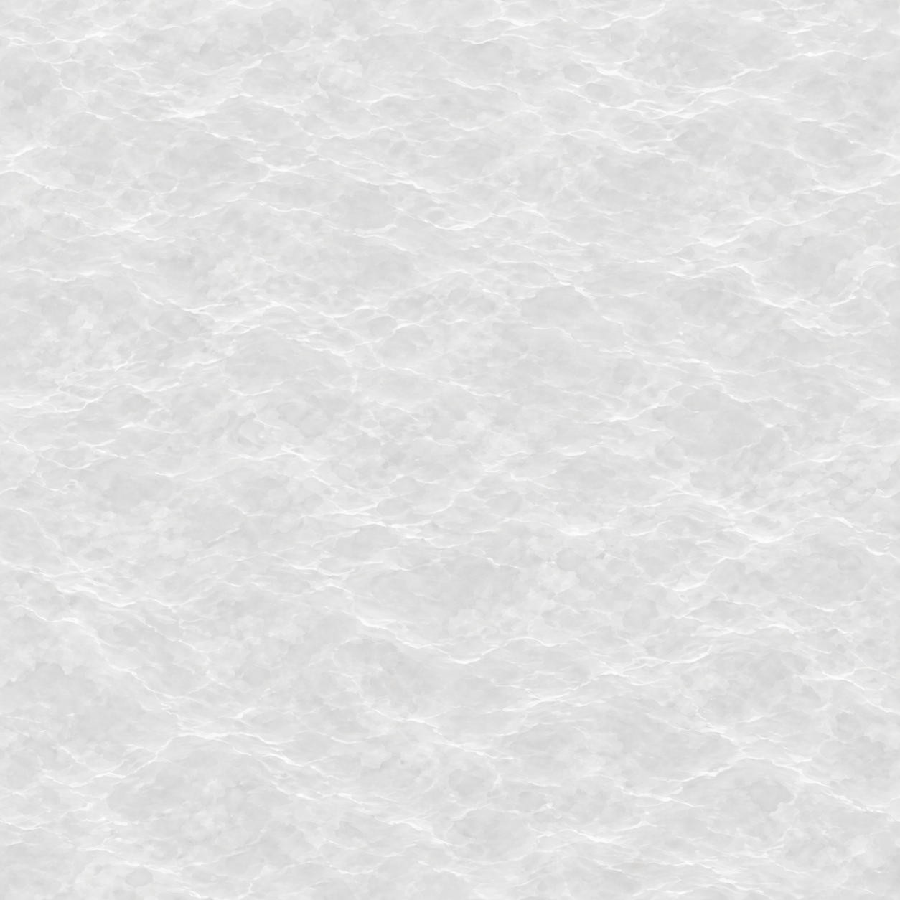
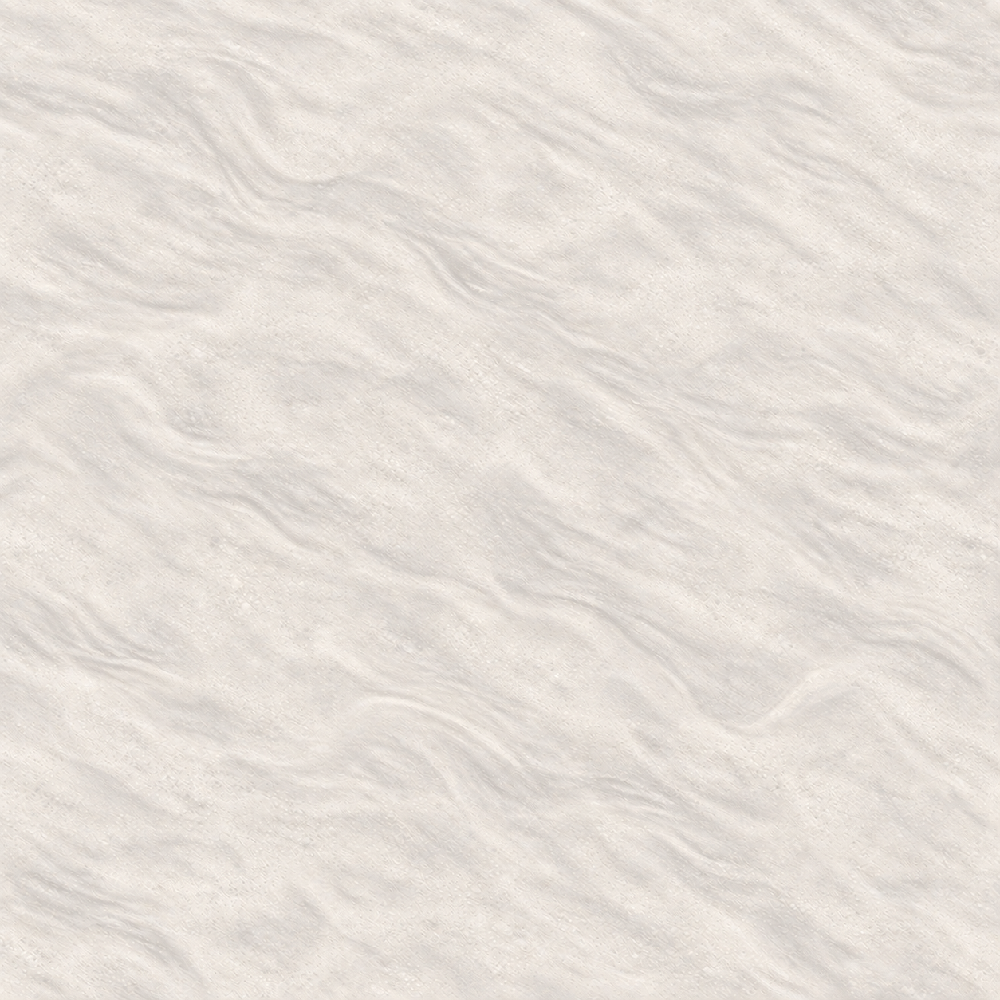

# Frontier water and shoreline v1

**Maturity:** versioned source and runtime texture pack. Renderer hookup and a representative in-game view remain pending.

This pack supplies two neutral albedo-detail maps for the existing blocked-water cells. They are texture modulators; the renderer's vertex colors remain responsible for the final water and bank palette.

| Material | Source / runtime | Canvas | Intended repeat |
| --- | --- | ---: | ---: |
| Water surface | `water.png` / `water.webp` | 1254 × 1254 / 768 × 768 | 12 map cells |
| Wet shallows | `shallows.png` / `shallows.webp` | 1254 × 1254 / 768 × 768 | 1 map cell |

Use sRGB sampling, mirrored-repeat wrapping, and UVs derived from world X/Z in map-cell units. The water field is deliberately faint so the renderer's slate-teal tint dominates. The shallows map is similarly restrained to avoid reading as a gravel beach at game zoom.

This pack does not change water placement, collision, or passability. Current `main` still renders water from vertex colors; these textures are not loaded by the game yet. The renderer integration should preserve the existing geometry and palette, expose matching UV/material ranges, and serve the manifest and runtime WebPs through the client asset allowlist and Docker image.

Generation prompts, source/runtime hashes, encodes, and tiling measurements are in [`PROMPTS.md`](./PROMPTS.md) and [`PROVENANCE.md`](./PROVENANCE.md). The machine-readable material contract is [`manifest.json`](./manifest.json).

## Source textures

