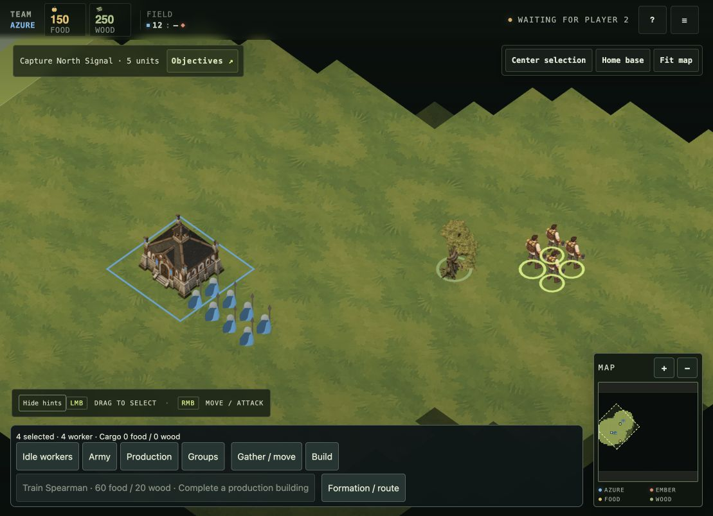

# Human roster production

User goal, 30 September 2026: complete Humans for every implemented unit type. The approved Human Worker game appearance sets the size/detail baseline; no Meshy stage. Current registry: Worker, Infantry, Spearman, Archer. Future mounted/siege units are outside the current roster.

## Completion gates

Each role needs eight directional facings with idle, alternating walk, role attack and complete defeat coverage; Workers additionally need wood/food gathering and build/repair. Consistent identity, handedness, camera, grounded pivots, non-clipped weapons, neutral equipment and separate team sash mask are required. Pack validation, state/timing tests and in-game captures at ordinary/strategic zoom establish acceptance. Static pose holds are previews and cannot satisfy animation completion.

## Checkpoint

Worker has an approved size/detail appearance preview and eight idle source facings. Its walk/chop/defeat sources require corrective production; team sash mask remains pending. Infantry, Spearman and Archer begin with role appearance/facing sheets, then action sheets. Runtime integration will preserve gameplay rules and the approved apparent height, with its difference from the older approximate 0.8-world-unit guide explicitly documented.

The Infantry retains the contracted short spear/six-sided shield. Spearman uses a distinctly longer two-handed spear and no broad shield. Archer uses bow/quiver and a lighter silhouette. All share cream/sage/olive/brown craft materials and restrained butter yellow accents.

Infantry and Spearman idle appearance candidates are saved in `source/`; front E/SE views remain too similar for directional acceptance, and Spearman weapon/body framing needs correction. The Worker combat state previously held idle during attacks; it now selects the attack clip and returns to its work task afterward, verified by the sprite clock tests (5 passing).

Archer idle appearance candidate is saved. `worker-walk-SE-v2.png` is rejected: it repeats the same leg arrangement . Use exact source pose seeds for the next action pass. `coverage.json` tracks acceptance separately from generated-source availability; nothing is marked complete yet. Full generation prompts are in `prompts-v2.json`.

## Motion checkpoint

Explicit source pose transfer produced `worker-walk-SE-v3.png` with alternating stride. Alpha inspection corrected the earlier backdrop assessment: brown RGB lies beneath transparent pixels. `cast-human-sprite-v3` packs the eight SE walk keys beside the idle facings; manifest validates and the six sprite timing/state tests pass. `?humanVaeloraPreview=1&humanAnimationPreview=1` opts in. Other directions/actions still hold idle and must not be counted complete. In-game motion/scale review is next.

`prepare-human-pose-seeds.py` builds 32 action/direction references from the existing Human layout, with source frame IDs preserved. `build-human-walk-preview.py` reproduces the current motion preview pack. Worker repair selects a repair clip with build fallback; food/wood gathering can select distinct clips with generic gather fallback.

## Camera and movement review

The v3 pack now maps the turnaround screen views to runtime world yaw. `unit.angle=0` points +Z; camera is at +X/+Z. Thus north is front-left, north-east front, east front-right, south-east right profile, south rear-right, south-west rear, west rear-left and north-west left profile. The original turnaround E/SE remain too similar and require a true side-view correction. Other military turnarounds need the same mapping when packed.

Local movement orders loaded the v3 atlas and moved the four selected Humans. The capture below shows appearance after movement, not proof of a smooth complete cycle. Full motion review is still pending. Rear walk source v1 preserves gait but has inconsistent axe placement and is excluded.

## Infantry actions

SE walk source preserves alternate strides and spear/right + shield/left equipment. `infantry-sprite-v3` packs eight idles and the eight SE walk keys; manifest validation and six sprite state tests pass. `?humanRosterPreview=1` now enables both Worker and Infantry candidates. Other Infantry action/direction states hold idle and remain incomplete; body scale between idle/walk needs game review.

SE attack has distinct guard, draw-back, thrust and recovery poses. Spear tips cross nominal cells, so `extract-human-source-components.py` extracts complete connected figures at the renderer alpha threshold instead of cutting on cell lines. All eight silhouettes have whole-sheet clearance; extraction manifests retain bounds and source provenance. These attack frames still need scale/root normalization, motion review and packing.

## Archer action checkpoint

Archer SE walk and eight bow attack poses are generated and packed in `archer-sprite-v2`, retaining quiver, cape and left-held bow. Attack keys span reach/nock/draw/release/lower on a one-second sequence. The source and extracted figures preserve complete equipment; manifest validates. Infantry SE attack is now packed on larger 512-pixel canvases at the same source scale so thrust reach does not force smaller bodies. Both need game combat/motion/scale acceptance.

`?humanRosterPreview=1` now loads Worker v3, Infantry v3, Spearman v1 and Archer v2. Spearman v1 contains eight idle facings and a diagnostic SE walk candidate; v4 removed extra hands but failed sheet-edge clearance; runtime retains v3 diagnostic frames with hand correction outstanding. Other action/direction states hold idle, team mask remains zero, and no full-role completion is claimed. Six sprite state/timing tests pass. Generation used built-in imagegen; exact prompts are in the role action prompt JSON files.

Spearman attack SE v1 now supplies eight distinct two-handed thrust keys in the diagnostic pack (0.2.0). The atlas is 2048×3072 with 512px frame canvases; body scale is independent of spear reach. Source extraction validates all eight sheet bounds before writing any frames so a rejected source cannot partially overwrite an existing action.

Worker construction SE v1 now has eight mallet keys in Human v3 pack 0.6.0. It is a distinct build clip rather than an idle hold. Larger 512px action canvases preserve raised-tool clearance; packing keeps the existing body scale. Repair can fall back to build, but separate repair coverage remains pending. The candidate needs exact heading, root and in-game construction timing review.

Human v3 pack 0.7.0 includes eight SE wood-gathering keys in a dedicated gather-wood clip. Food gathering remains an idle hold and unproduced. Raised axe uses 512px canvas with no edge contact; in-game gathering, heading and loop review remain pending.

Human v3 pack 0.8.0 adds eight SE food-gathering poses. Food uses hand gathering and a belt pouch, distinct from the wood axe swing. Both clips select by worker cargo resource type, falling back to generic gather when unavailable. In-game selection and motion review remain pending.

Human v3 pack 0.9.0 includes eight dedicated SE repair keys: kneeling iron hammer instead of standing construction mallet. Repair now selects its own clip for this heading. Unproduced headings retain existing fallback. Art and runtime repair review remain pending.

Human v3 pack 0.10.0 adds eight SE Worker combat poses as a one-shot axe-sweep clip. Defeat remains a hold; other headings remain unproduced. Full weapon reach uses 512px frames, expanding the atlas to 2048×5120. Game loading and combat timing remain pending.

Expanded 2048×5120 Human atlas verified loading in the local game with Infantry visible. Four Workers received wood orders; wood increased from 250 to 450 with cargo displayed. `in-game-wood-harvesting.jpg` records active harvesting appearance. It does not prove the full SE action cycle or other headings; acceptance remains pending.

Human v3 pack 0.11.0 adds eight rear-facing SW walk frames from corrected source v2, filling a second movement heading. All connected silhouettes and 256px canvases clear boundaries. Body normalization uses head-to-foot source height, not weapon extent. Motion/root validation in game remains pending.

Human v3 pack 0.12.0 adds eight SE defeat keys with a final ground pose. Defeat is non-looping and retains its final frame. Every Worker action now has an SE source candidate; this does not establish accepted camera, motion or complete directional coverage. Atlas expands to 2048×6144; further growth needs packing/texture-bound review.

Infantry v3 pack 0.5.0 adds eight SE defeat keys, retaining short spear/shield/helmet through a non-looping fall. Every Infantry action now has an SE candidate. Other headings, team masks and animation acceptance remain pending.

Archer v2 pack 0.5.0 adds eight SE defeat poses, retaining bow/quiver/cape through a non-looping fall. Every Archer action now has an SE candidate; motion and directional acceptance remain pending.

Spearman v1 pack 0.3.0 adds eight SE defeat keys with spear/cap retained. All four implemented Human roles now have every required action as an SE candidate, with a second Worker walk heading. This is source coverage progress only: exact directional acceptance, motion, team masks and full in-game verification remain unfinished.

Front-facing Worker walk now has eight independent contact/down/passing/up candidates. `worker-front-eight-key-review.png` and `worker-front-eight-key-playback.webp` expose the sequence at provisional 232px body height. They are not packed or accepted: axe geometry drifts across frames, ground-root/anatomical calibration is pending, and runtime loop verification remains required. Other roster requirements remain unchanged.

Human v3 pack 0.13.0 adds eight front-facing north-east Worker walk candidates from unified source v2. Whole-silhouette extraction passes all eight. Transparent-margin compaction reduces the runtime atlas from 2048×6656 to 2048×2048 while verifying reconstructed RGBA pixels for all 80 frames and retaining original canvas pivots. Seven sprite-clock/state tests pass. This is not visual acceptance: anatomical/root calibration and actual game loop verification remain pending; all other directional and team-mask gaps remain.

Combat atlas compaction preserves reconstructed RGBA pixels and original frame canvas offsets for all 32 frames per role. Infantry and Archer now use 2048×1024 atlases; Spearman uses 2048×2048. All role builders invoke the same compactor. Local server started successfully, but browser policy rejected binding the preview tab; no in-game visual evidence was obtained for these trimmed layouts. Directional/art acceptance and team masks remain pending.

User steering: initial graphics for every moment are sufficient even when animation sequences are wrong. Human roster now loads by default and opts into nearest-authored action reuse for unproduced headings, covering every implemented role/action with approximate graphics rather than idle holds. Candidate review defects remain recorded for polish; they no longer hold first-pass integration. In-game verification remains pending due to browser policy rejection.

First-pass integration audit: nine sprite tests pass, including every available gameplay unit type and every required action at all eight headings through approximate-direction reuse. All four atlas manifests pass the repository contract validator. Docker and ignore rules now include the new packs; a disposable release package contains their manifest/runtime atlas/mask files. Full server CI remains running; visual game acceptance remains pending.

### Integration against current main, 30 September

Current main additionally implements Scout, Rider and Siege Engine. These retain their existing mounted/siege placeholder geometry; this sprite slice covers the four foot roles. Their bespoke art remains outstanding. All four foot roles resolve non-idle action graphics in every heading, using approximate nearest-heading clips where needed. Atlas validation, nine sprite tests, documentation links and disposable release packaging passed. The broader suite stopped at a mirrored Infantry combat message timeout, before the main rebase; it is not recorded as passing. Browser policy blocked the live appearance capture, so post-integration in-game appearance remains unverified.

The focused mirrored Infantry combat retry passed on current main, covering both seat layouts and both command orders. Current-main disposable release packaging also passed. PR #279 tracks integration; hosted CI is pending.
