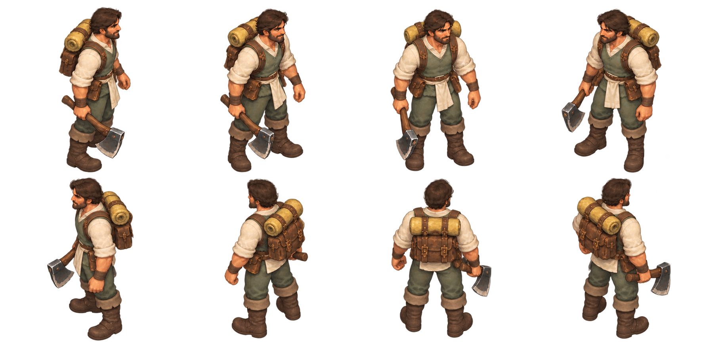
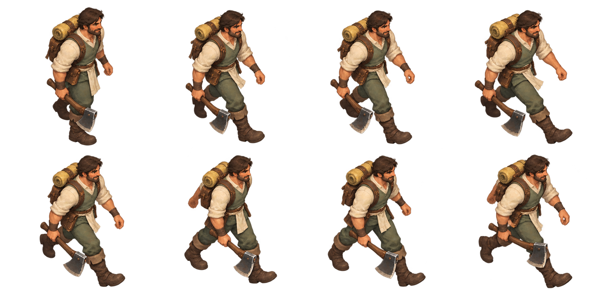
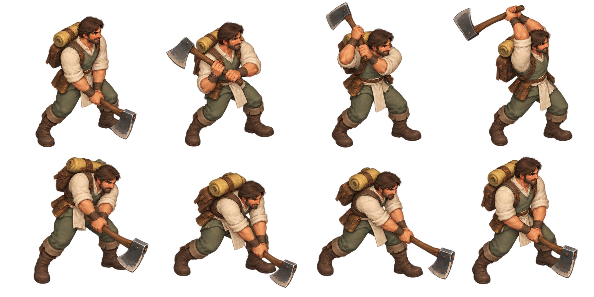
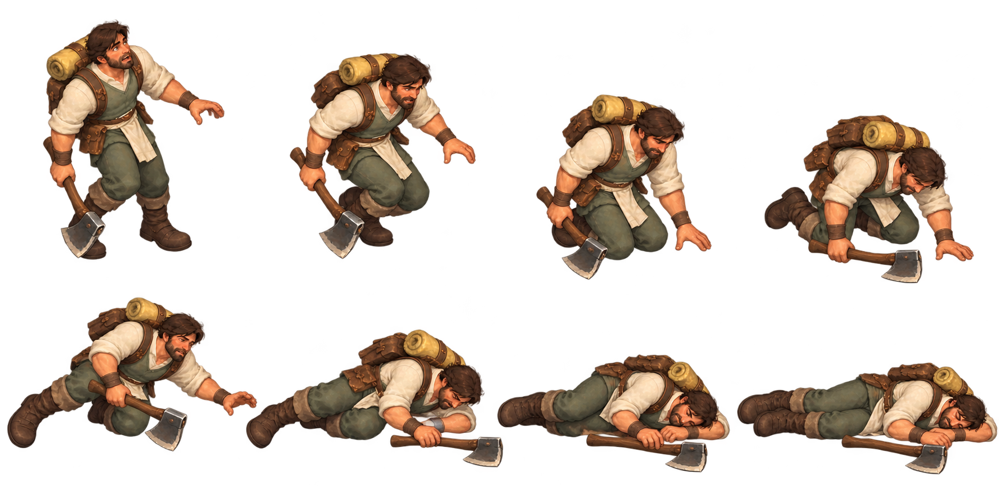
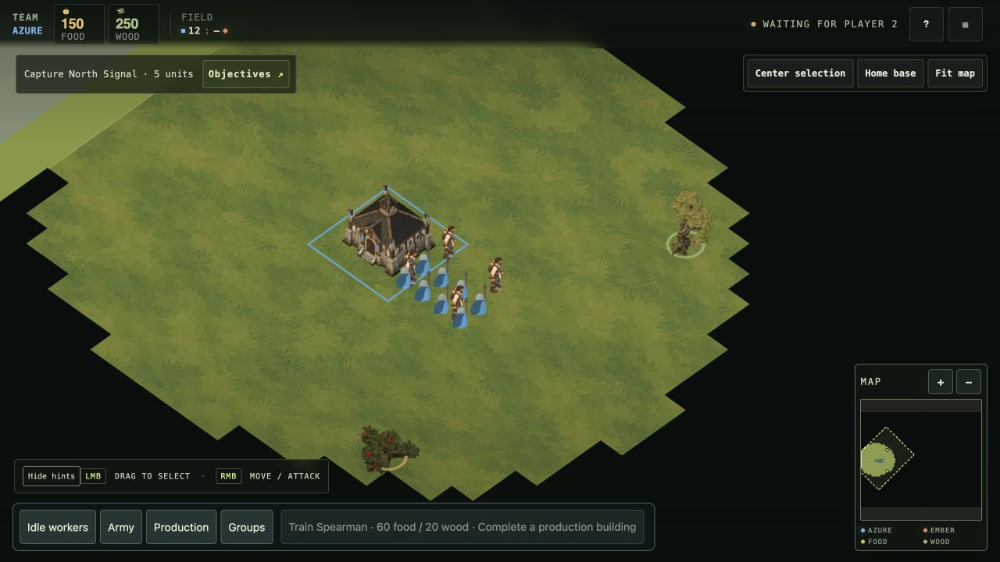

# Human Worker — Vaelora sprite direction

30 September 2026. User-corrected art direction: downloaded HD pack and supplied axe strip are organizational/pose/fidelity references, **not the desired painting style or costume**. This Human-only source set follows the checked-in [art contract](../../art-direction-contract-v1.md) and [Bellweather ecology key](../vaelora-v1/bellweather-ecology.png). The Common Hearth human concept supplies clothing inspiration; its proposed faction membership is not binding canon.

## Human design

Warm expressive adult face, dark swept hair/short beard; cream linen, sage wool, olive trousers, brown leather pack and boots, butter-yellow bedroll, matte copper fasteners and neutral iron/wood axe. Broad painterly value shapes and welcoming everyday craft establish Vaelora identity. A neutral cream sash reserves a separate Azure/Ember ownership layer; no mask has yet been authored. No indigo-apron reference costume is carried forward.

The existing Human maps were inspected from south-east and north-west: eight walk samples, sixteen attack/work samples, eight defeat samples and one idle in each source map. Their elevated camera and pose mechanics inform these sheets. Actions are separated to give larger source poses; this does not change the existing runtime atlas contract. Actual game camera is approximately 45.4° elevation, per the pipeline; generated camera matching remains visual rather than calibrated.

## Source sheets

| Source | Coverage | Review limit |
| --- | --- | --- |
| [Idle facings](source/Idle/facings.png) | Eight intended clockwise yaw views, E/SE/S/SW/W/NW/N/NE | Front E/SE are close in angle; exact yaw, tool handedness and common scale require review |
| [Walk](source/Walk/SE/keyposes.png) | Eight south-east locomotion keys | Several gait keys repeat leg arrangements; not accepted as smooth alternating motion |
| [Chop](source/Chop/SE/keyposes.png) | Eight ready/lift/backswing/strike/recovery keys | Raised axe approaches or contacts sheet edge; framing must be corrected before extraction |
| [Defeat](source/Defeat/SE/keyposes.png) | Eight standing/buckle/kneel/fall/settle keys | Prone poses cross cell boundaries and touch sheet edges; recapture/regenerate complete frames before runtime packing |

These are high-detail source candidates, not complete eight-direction animations, runtime assets or gameplay proof. `review.json` records actual dimensions, hashes, alpha bounds and nominal/whole-sheet edge contacts. Do not repair missing pixels by nominal cropping or claim pixel-audit success where edge contacts remain. The action library still needs idle breathing, food gather, build/repair and role-specific combat as applicable. Runtime state mapping remains unchanged.

All four sheets are built-in imagegen outputs using project-owned generated direction art and existing Human sprite pose maps as references. Full prompts and input roles are retained in `prompts.json`. Earlier Human/Dwarf high-fidelity studies in `humanoid-sprite-production-v1` are superseded for art style; its downloaded-pack inventory remains useful structural research.

## Local appearance preview

The opt-in `?humanVaeloraPreview=1` loads `assets/units/cast-human-sprite-v2` and paints all workers with the new Human idle facings. Infantry keep their existing renderer. Atlas validation and JavaScript syntax checks passed; the local Forked Vale battlefield was visually captured at close game zoom. This is an appearance check in a waiting lobby, not animated match proof. All action states hold idle; team sash mask is pending. Normal default rendering is unchanged.

