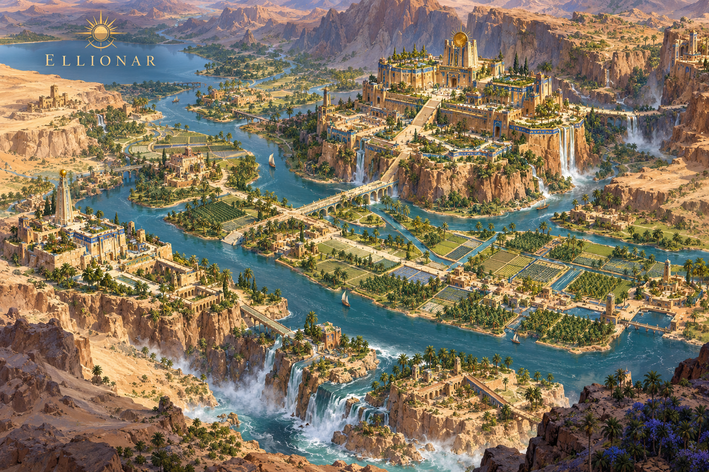
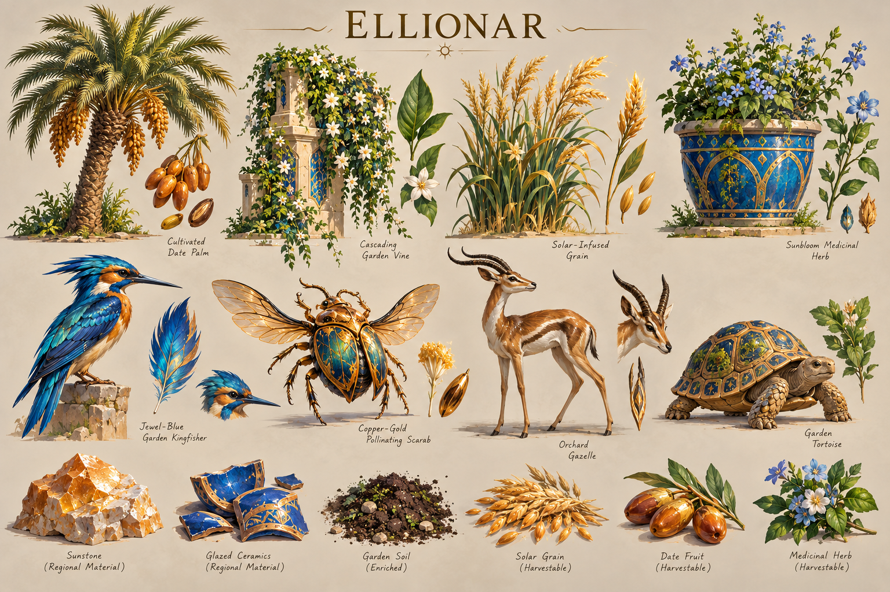
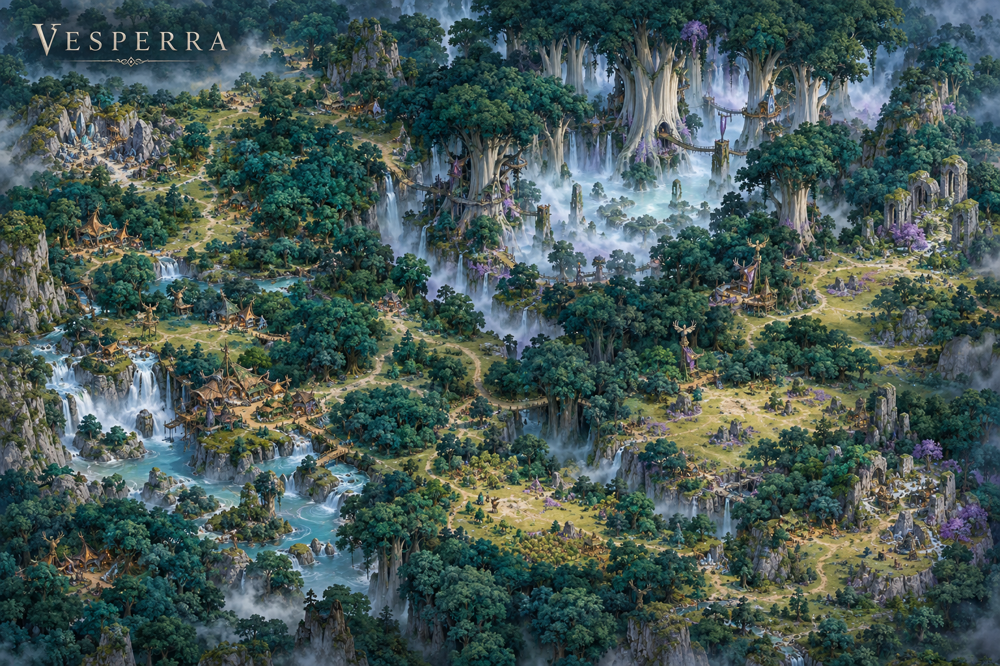
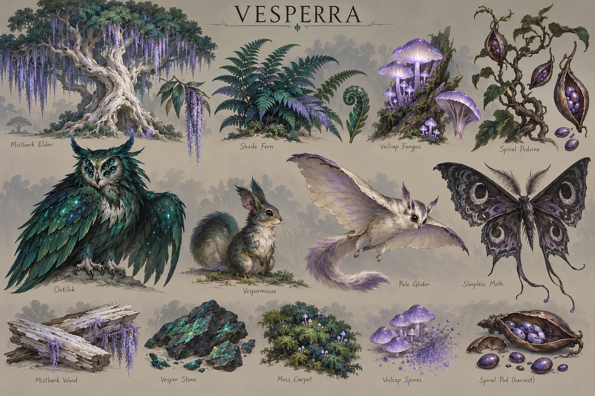

# Vaelora — art-direction checkpoint

User-selected concept checkpoint, 29 September 2026. Vaelora is the working world name.

This collection retains the latest world atlas, ten individual zone maps and ten flora/fauna keys selected in the art-direction conversation. Earlier atlas, battlefield and culture-sheet iterations from that conversation are superseded and omitted. The old September 26 direction study remains solely as a dated historical reference linked by the archive.

These are aspirational paintings, not playable maps, texture atlases, production models or evidence of runtime appearance. Camera, footprint, team cues and asset contracts remain authoritative. Specimen sizes are illustrative; tiny labels, incidental anatomy, ornaments and generated resource uses are not production specifications. Vesperra and the Sombral Mere currently lean especially magical. Field-guide names are provisional.

## Shared direction

Warm, expressive everyday life beside immense lost power. Broad painterly forms and distinct regional palettes must survive thumbnail and gameplay scale. Regions define ecology and terrain; cultures define craft and architecture; factions define allegiance. People can travel and settle beyond their heartlands. Player team colors remain separate from cultural palettes.

The author's Colossumbra, Dreadvael and Container 67 material informed this direction: tangible cosmic consequences, inherited systems that users imperfectly understand, unequal access to knowledge, material costs of power, practical responses to strange events, and dry situational humor. Keep inviting places and ordinary work alongside danger; do not make every region another curse or bargain.

## Culture and lore checkpoint

- Sun elves (Ellion’ar): Ellionar's Babylonian-inspired stepped garden cities, irrigation, lapis glazing, copper and solar horticulture.
- Star elves (Steorran’ar): the Pale Meridian's cold northern plateau, long winter nights, astronomical instruments and warm communal interiors. Long summer days also matter; permanent winter darkness is not established.
- Moon elves (Soman’ar): the Sombral Mere's forest lakes, lunar gardens, opals and traditions responding to Lumastrazil's silence.
- Desert humans and the explored bull/jackal peoples share Wayfarer craft traditions: indigo/coral textiles, ceramics, cisterns and caravan routes. Bull/jackal anatomy and ancestry names remain exploratory; the earlier character sheets are not part of this selected map/key package.
- Working faction names: the Common Hearth, the Open Passage, the Continuance and the Boughward. These are political/cultural proposals, not implemented gameplay factions or ancestry restrictions.
- Ru’Lora draws directly from the author's story: a petrified night jungle, toxic dust, salt caverns, immense remains of shadow god Colossumbra, lingering essence and demons refusing sacrilegious entry. Living fringe ecology is a new proposal; the interior is not an inhabited demon town.

Existing author notes describe lost star elves, depleted or extinct moon elves, and a temperate sun-elven homeland. Living northern enclaves, surviving moon communities and desert garden cities are proposed RTS adaptations, not silently resolved story canon. The earlier generic ancient-network premise remains optional rather than the explanation for every landmark.

## Regional keys

### Bellweather

Sage, butter yellow, cream; broad oaks, pears, barley, sheep and meadow wildlife.

### The Underbough

Burgundy, copper orange, moss; exposed roots, brambles, fungi and woodland fauna.

### The Sereward

Peach, coral, turquoise; water-storing plants, palms, caravan beasts and oasis wildlife.

### Ellionar

Honey sandstone, lapis, copper, cultivated green; terraced gardens, solar grain and pollinators.

### The Veyrholds

Slate, alpine olive, rusty copper; wind-shaped pines, goats, raptors and iron-bearing rock.

### The Pale Meridian

Midnight blue, frost white, silver, violet; low hardy plants, shaggy pack beasts and winter fauna.

### The Siltmouths

Sea green, silver, muted lilac; reeds, exposed tidal roots, marsh tubers and estuary fauna.

### Vesperra

Petrol green, pale bark, violet; ancient canopy, ferns, fungi and rare supernatural inhabitants.

### The Sombral Mere

Pearl, lavender, deep teal; lakeside trees, nocturnal flowers and reflective aquatic fauna.

### Ru’Lora

Charcoal, dusty violet, ivory, cold opal; living emerald fringe versus petrified interior.

## Production use and provenance

Choose a bounded location from a zone map, then derive its ground, vegetation, resource and building families from the accompanying ecology key. Review actual silhouettes and palette at ordinary and strategic zoom before claiming runtime success. Paintings do not add harvest mechanics, creatures, factions or special resources to the simulation.

All 21 PNGs are unmodified built-in image-generation outputs from this conversation. The manifest records source filenames, dimensions, sizes and SHA-256 hashes. No third-party image inputs were supplied to these generations. Private source stories remain outside the repository; concepts are attributed here without copying their manuscripts. Generation does not establish clearance for incidental output details.
