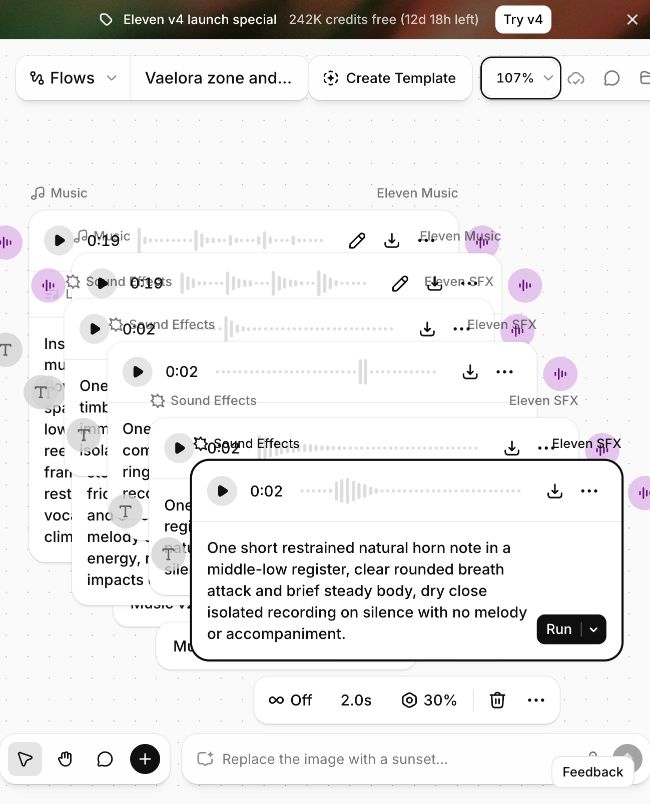

# Vaelora audio pilot in the subscribed workspace

[UI direction](ui-audio-direction.md) · [Zone plan](vaelora-zone-audio-plan.md)

30 September 2026. The user authorized starting the pilot after the account
check. The signed-in website denied access to the plugin-created flow. A new
[pilot flow](https://elevenlabs.io/app/flows/fvHx5prtAQnXfCiRKcZz) was therefore
created through the website in the user's subscribed workspace. This establishes
an access mismatch; it does not establish the plugin's account identity or fix
its credential/quota configuration.

One take was run per family, sequentially, rather than repeating the plugin's
four-variation batch. No plan or billing setting was changed. All seven takes
were observed with playable results: music displays approximately 19 seconds
for a requested 20 seconds; effects display two seconds. Bellweather was observed
completed before subsequent nodes moved it outside the virtualized canvas view.

| Family | Requested settings | Exact prompt |
| --- | --- | --- |
| Bellweather everyday | Music v2, lyrics off, 20 seconds | Instrumental pastoral chamber folk, warm, companionable and quietly wistful, 96 BPM in 4/4, D Dorian, spacious eight-bar phrases over a D/A pedal. Wooden flute with restrained hummable melody, muted lute answers, warm low bowed viol and very light wood percussion; intimate dry acoustic production with breathing gaps. Gentle even energy, no vocals, epic brass, modern drums or crescendo, softly sustained ending. |
| Ellionar everyday | Music v2, lyrics off, 20 seconds | Instrumental luminous ceremonial chamber music, cultivated, assured and gently flowing, 96 BPM in 4/4, D Dorian with spacious eight-bar phrases. Plucked lyre and low harp trade measured answers with paired reed pipes, sparse copper bowls and soft frame drum, warm acoustic room and restrained dynamics. Quiet even energy, no vocals, fanfares, modern drums or dramatic climax, open sustained ending. |
| Ru’Lora interior | Music v2, lyrics off, 20 seconds | Instrumental sparse dark acoustic chamber texture, immense, absent and forbidding, half-time feeling over a quiet D/A pedal at 96 BPM. Low contrabass harmonics and bowed stone-like resonances, rare dry ceramic friction and one cold glass tone, long silences and controlled natural decay, almost no melody or percussion. Minimal restrained energy, no voices, choir, screams, cinematic impacts or heavy sub-bass, fade into silence. |
| Wood token | Eleven SFX, loop off, 2 seconds, 30% influence | One small hardwood token tapped on a timber board, warm rounded knock with crisp immediate contact and short dry decay, close isolated recording on silence. |
| Iron latch | Eleven SFX, loop off, 2 seconds, 30% influence | One worn iron buckle snapping closed, compact dull metallic click with very little ringing, immediate onset, close dry isolated recording on silence. |
| Muted pluck | Eleven SFX, loop off, 2 seconds, 30% influence | One softly plucked gut lute string in a middle register, clear warm attack and short muted natural decay, dry isolated recording on silence with no accompaniment. |
| Horn note | Eleven SFX, loop off, 2 seconds, 30% influence | One short restrained natural horn note in a middle-low register, clear rounded breath attack and brief steady body, dry close isolated recording on silence with no melody or accompaniment. |

These are completed generation candidates, not accepted audio. No listening,
pitch/tempo verification, source download, editing, pack import or runtime
integration is claimed. Actual credit charges were not independently verified.
Next work is auditioning the candidates and editing the useful sources into
the UI recipes and regional arrangements.

## Download checkpoint — 30 September 2026

Seven original MP3 files are saved in the [source pack](../assets/audio/vaelora-pilot-v1/README.md), including an extra horn take. All files match their downloads byte-for-byte. The earlier no-download statement records the initial generation checkpoint. Bellweather remains undownloaded: its result was absent after reloading the flow and using Zoom to fit, and Music history did not expose it. No replacement was generated. Audition, editing, and runtime integration remain outstanding.

## All-zone follow-up

The [all-zone milestone](qa-zone-audio-2026-09-30.md) adds a new Bellweather sketch and completes 44 candidate ingredients across ten zones. The original inaccessible Bellweather pilot result remains distinct; its history above is preserved.
