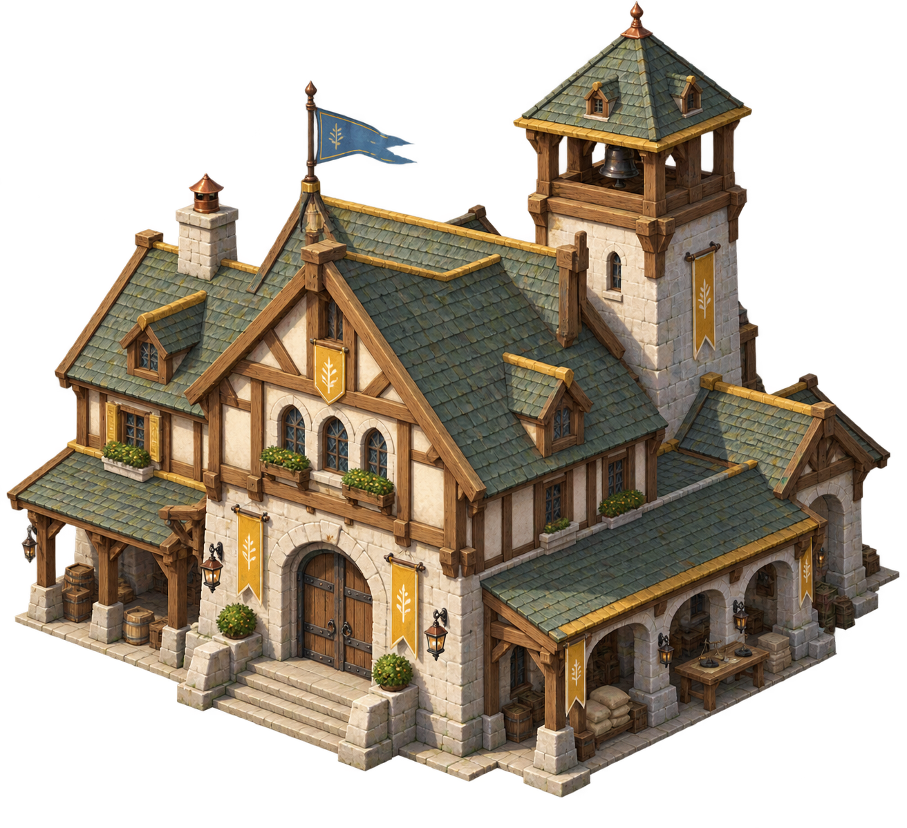
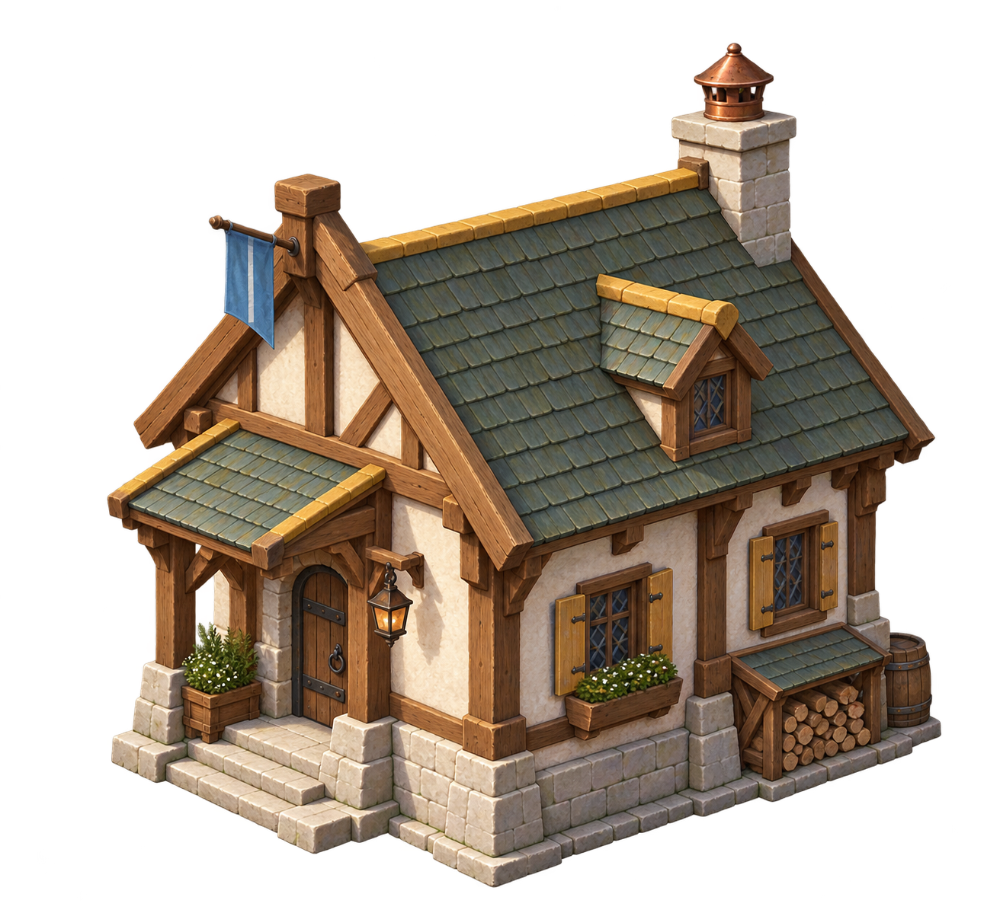
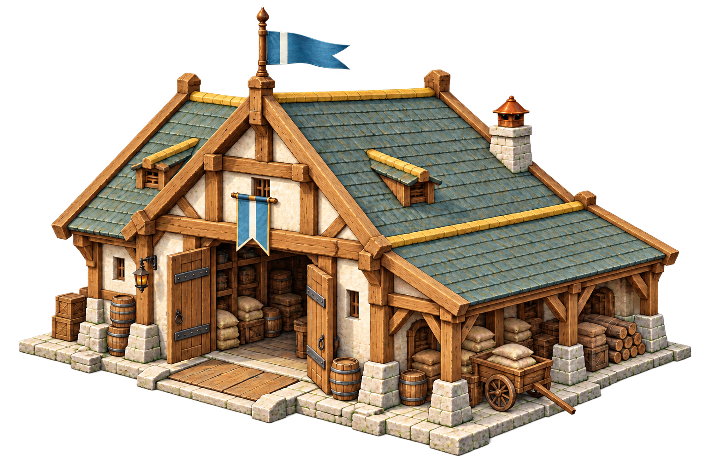
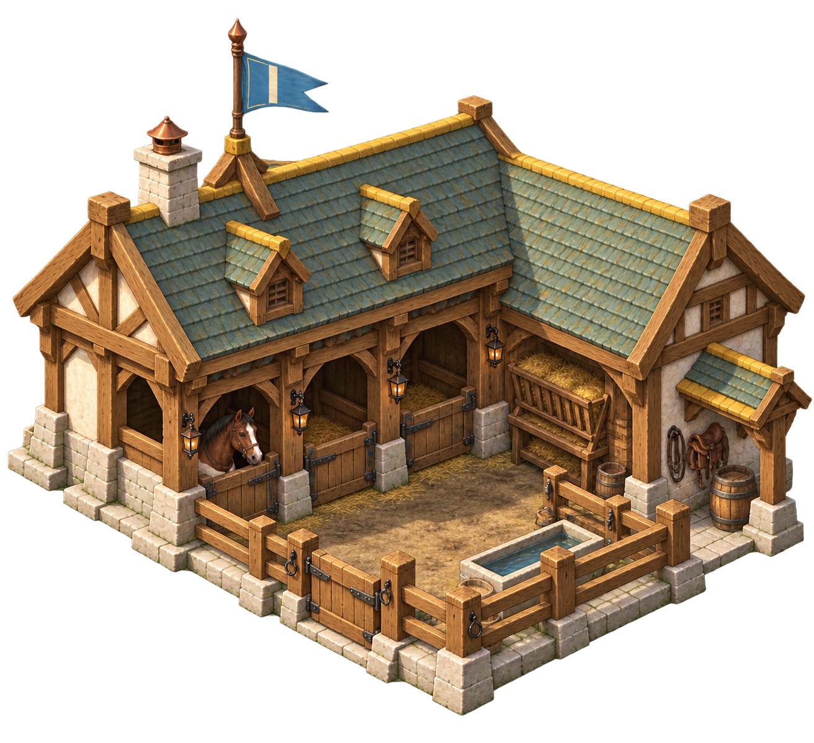
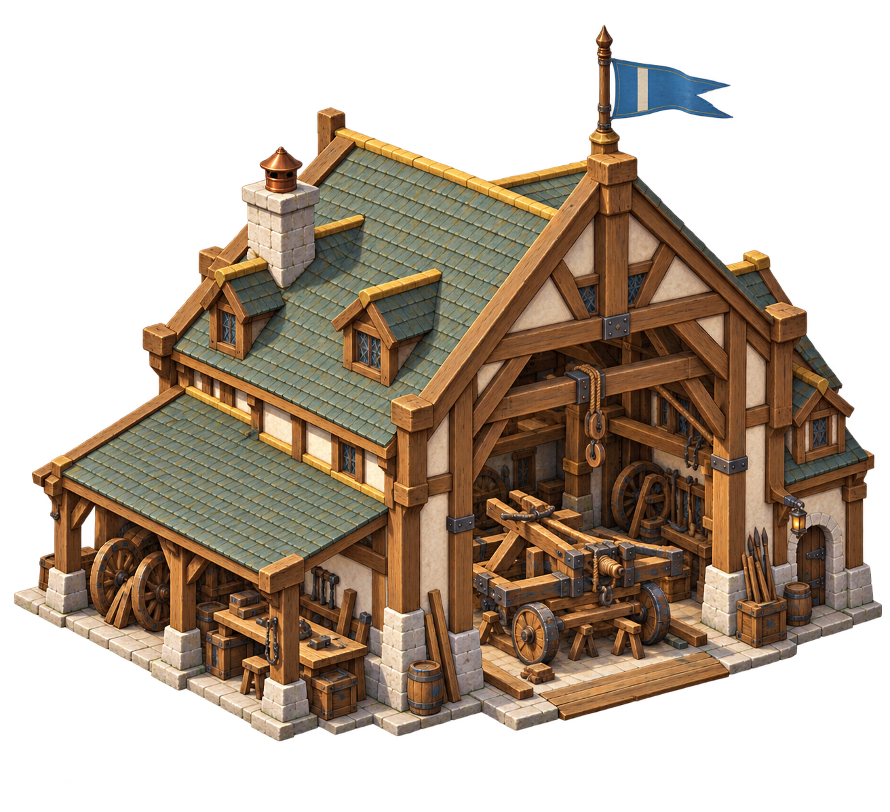
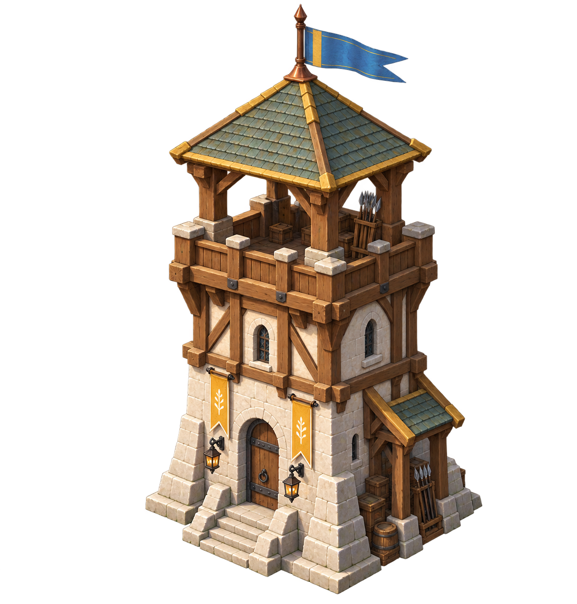
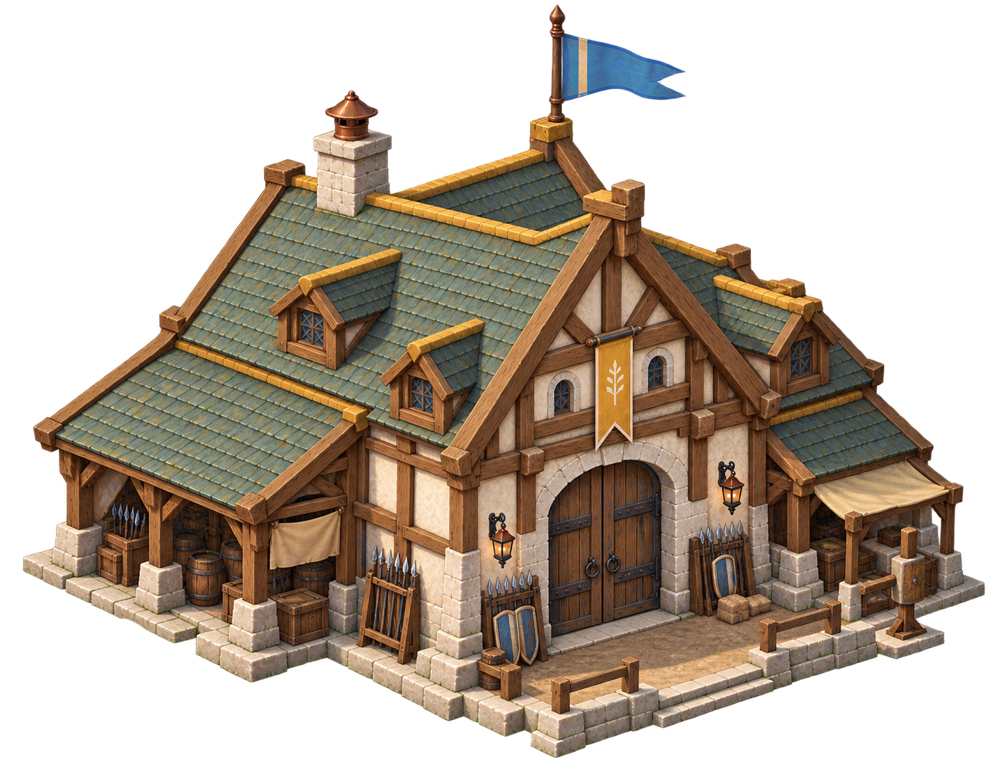
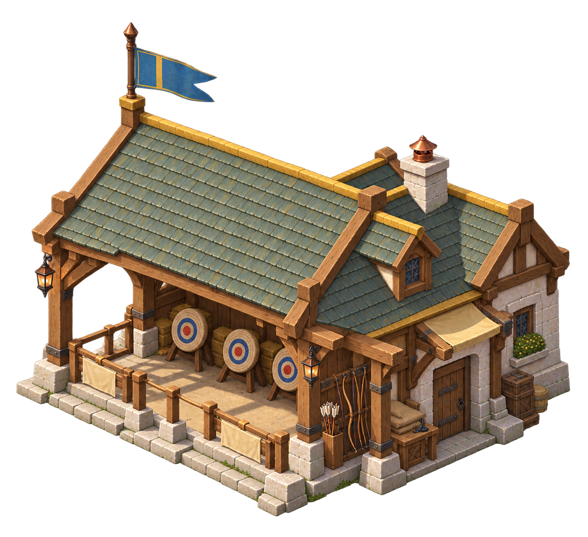
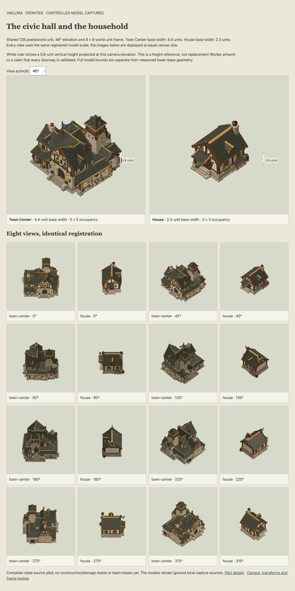

# Frontier settlement architecture

**Status:** working architectural kit for the first playable civilization; eight complete-building source concepts. Bellweather inspires the craft vocabulary. Frontier is the gameplay roster name, not a newly established ancestry or political institution.

Cream limewash, pale river stone, honey-colored oak and sage roofs tie the settlement together. Ochre details bring warmth, while the buildings' forms express their work. A household has a modest gable; a store has a broad loading door; a militia hall encloses its training stores. The civic hall is wider and more complex than its neighbors, with arcades and a bell tower that can be recognized above the roofs.

This kit develops [Bellweather's cultivated character](regions/bellweather.md) and the selected [Vaelora art direction](../art-direction/vaelora-v1/README.md). It does not establish the architecture of every human community or assign Forked Vale a canonical location. Azure and Ember standards identify match ownership; they are independent of these material traditions.

## Town Center

The civic hall combines an assembly building, covered delivery frontage and a rear bell tower. Its broad entrance and connected wings make it the settlement's anchor. In the game, it trains Workers, receives food and wood, contributes population capacity and offers military progression research.

## House

A small household cottage shares the hall's materials without its civic tower or arcades. Chimney, sheltered door, shutters and a modest woodpile make domestic use clear. In the game, completed Houses increase population capacity.

## Storehouse

Large doors, sheltered stacks and a loading bay distinguish the Storehouse from a dwelling. Food and wood can be received here without sending every delivery through the civic hall. It produces no units.

## Stable

Open stalls, hay storage, tack and a compact fenced yard make the Stable's purpose visible. In the game, it trains Scouts and Riders and provides mounted research.

## Workshop

A wide assembly bay accommodates wheeled machinery. Heavy beams, spare wheels and a workbench give this building an engineering identity. In the game, it provides siege research and Siege Engine production after the required progression.

## Watchtower

The lookout rises from a compact stone base into a protected timber fighting platform. Its narrow, high silhouette differs from the broad civic tower. In the game, it supplies sight and fires at visible enemy units.

## Barracks

A sturdy enclosed hall, broad gate and organized weapons define the militia's building. Its simple gable shares the domestic craft vocabulary while its entrance and equipment signal military use. In the game, it trains Infantry and Spearmen and houses military research.

## Archery Range

An open canopy shelters targets and bow equipment. Clear shooting lanes and exposed posts make it lighter and more open than the Barracks. In the game, it trains Archers and provides fletching research.

## Scale and production status

The proposed Town Center base is 4.4 world units wide, compared with a 2.3-unit House. These starting targets address the observation that the current Town Center looks small and house-like. Individual wiki images are framed for detail and are **not to scale with one another**. Model/capture review must verify the complete family beside the current Worker before runtime adoption.

The renderings depict Complete only, from one illustrative view. Existing game art remains active while registered direction, construction, damage and team-mask production continues. Mills, farms, castles and other future buildings remain separate design briefs until their gameplay roles and footprints are selected. See the [production plan](../building-atlas-production-plan.md).

**Sources:** selected Bellweather map/ecology and art contract; current building definitions at main `f896d09`; newly generated images using the built-in image-generation tool. Exact prompts, source outputs and hashes are retained in the [concept pack](../../assets/buildings/frontier-civilization-concepts-v1/README.md). The [style guide](../frontier-civilization-art-style.md) records architectural, scale and team-treatment decisions. This is new working visual development, not a quotation from private source stories.

[Wiki index](README.md) · [Bellweather](regions/bellweather.md) · [Peoples and cultures](peoples.md)

## Controlled Town Center and House views

The first model pilot renders these two buildings at the same world scale. Town Center spans 4.4 units across its measured base, compared with 2.3 for House. The shared camera preserves that relationship across eight views per building.

[Explore the eight-view gallery](../../assets/buildings/frontier-civilization-scale-pilot-v1/preview.html). These are Complete source captures; active game art, lifecycle states and team treatment still require integration.

## Support-building directional sources

Storehouse, Stable, Workshop and Watchtower now have eight controlled Complete views each. [Review their shared-scale gallery](../../assets/buildings/frontier-civilization-models-v1/preview.html). These source captures extend the kit; doorway/bay scale acceptance, lifecycle/team treatment and active game integration remain outstanding.
