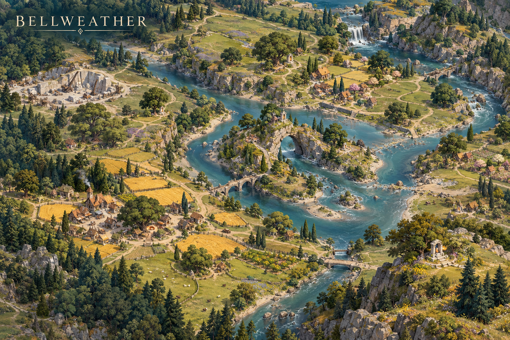

# Bellweather

**Status:** selected regional visual/ecological direction; livelihoods and relationships marked as working development.

## Art direction

[Regional map](../../art-direction/vaelora-v1/bellweather-map.png) · [Flora, fauna and materials](../../art-direction/vaelora-v1/bellweather-ecology.png)

These selected concept images establish visual direction; depicted details and specimen labels remain subject to lore and production decisions. See the [art checkpoint](../../art-direction/vaelora-v1/README.md) for provenance.

## Landscape

Broad oaks, pear trees, barley fields, sheep pasture and meadow wildlife give Bellweather a cultivated, generous character. Sage, butter yellow and cream distinguish its visual direction.

## Life and use

Farm households, mills and market yards make ordinary seasonal work visible. Working development favors grain, wool, orchard produce and tools exchanged through dependable routes. Prosperity has maintenance costs and differences in landholding, but the region is not defined by a curse.

## Connections

[Pellit](../settlements.md#pellit) is a proposed market town whose flour deliveries connect it commercially to [Ellionar](ellionar.md) and [Sereward](sereward.md). Its [First Loaf customs](../settlements.md#pellit) and shared reserves make harvest a social as well as economic event.

## Open questions

The number of towns, tenure systems and precise relation to neighboring woodland remain open. Bellweather is not automatically the location of Forked Vale.

**Sources:** [selected map and ecology key](../../art-direction/vaelora-v1/README.md), [world-building research](../../lore-research.md). New livelihoods are working elaborations, not facts recovered from private manuscripts. See [source register](../sources.md).

[World overview](../world.md) · [Wiki index](../README.md)
