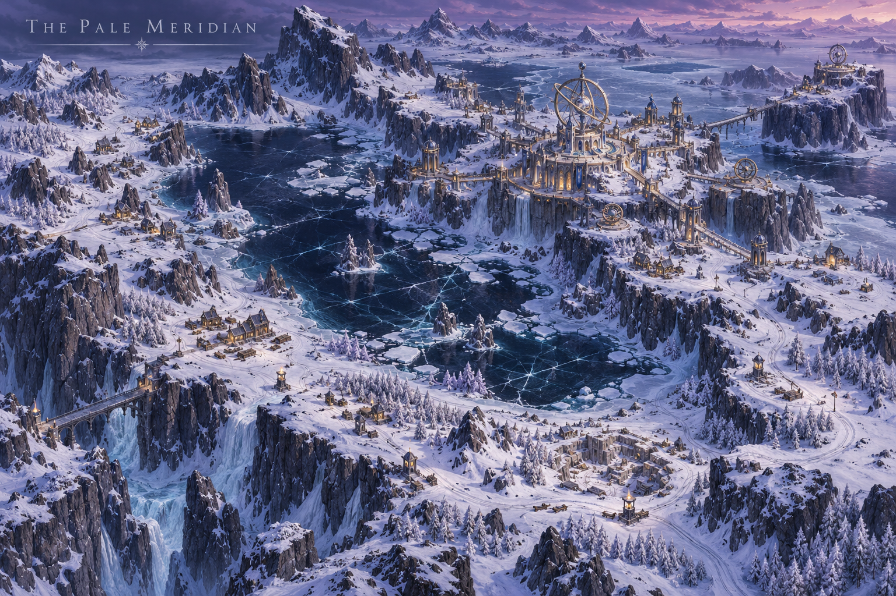
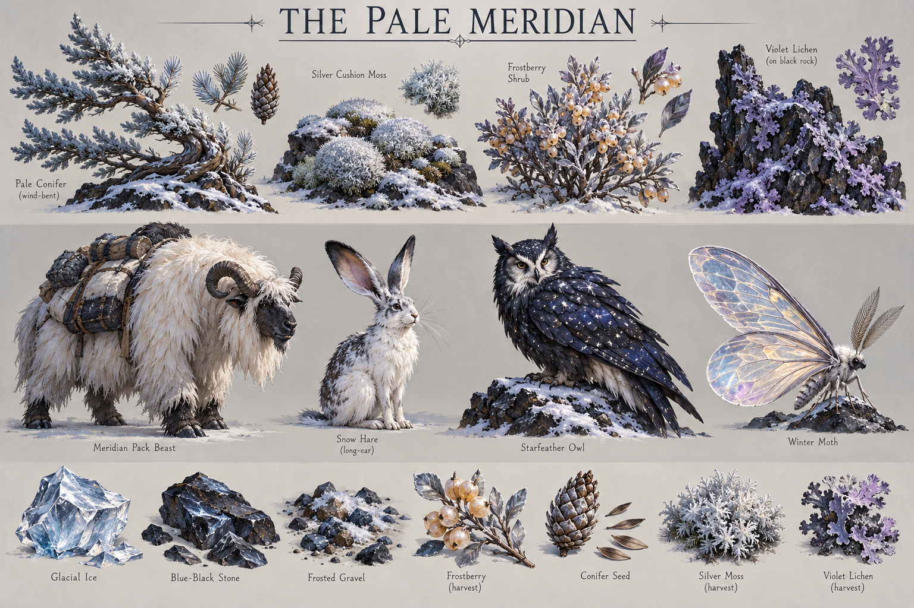

# The Pale Meridian

**Status:** selected regional visual/ecological direction; livelihoods and relationships marked as working development.

## Art direction

[Regional map](../../art-direction/vaelora-v1/pale-meridian-map.png) · [Flora, fauna and materials](../../art-direction/vaelora-v1/pale-meridian-ecology.png)

These selected concept images establish visual direction; depicted details and specimen labels remain subject to lore and production decisions. See the [art checkpoint](../../art-direction/vaelora-v1/README.md) for provenance.

## Landscape

A cold northern plateau carries low hardy plants, shaggy pack animals, astronomical instruments and warm communal interiors. Midnight blue, frost white, silver and violet frame its visual direction.

## Life and use

Long winter nights favor observation; long summer days also shape work and rest. The selected association is with [Steorran’ar star-elven traditions](../peoples.md#steorranar--star-elves). Source loss histories make present custodianship a real open question, not permission to assume thriving ancestral enclaves.

## Connections

Working development allows archives, instruments and seasonal observations to connect this region to the preservation concerns of [Continuance](../institutions.md). That connection does not establish its founding or ownership of every observatory. Compare the lunar inheritance of the [Sombral Mere](sombral-mere.md).

## Open questions

Who lives here, who built particular instruments and what knowledge remains usable are open. Permanent darkness, one shared cosmic disaster and a complete star religion are not selected.

**Sources:** [selected map and ecology key](../../art-direction/vaelora-v1/README.md), [world-building research](../../lore-research.md). New livelihoods are working elaborations, not facts recovered from private manuscripts. See [source register](../sources.md).

[World overview](../world.md) · [Wiki index](../README.md)
