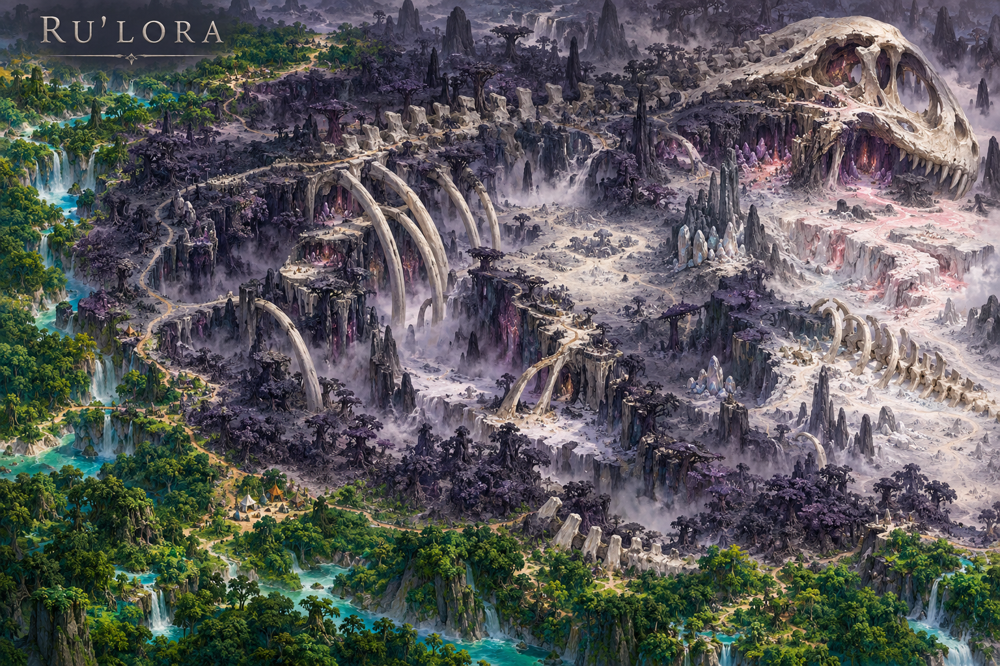
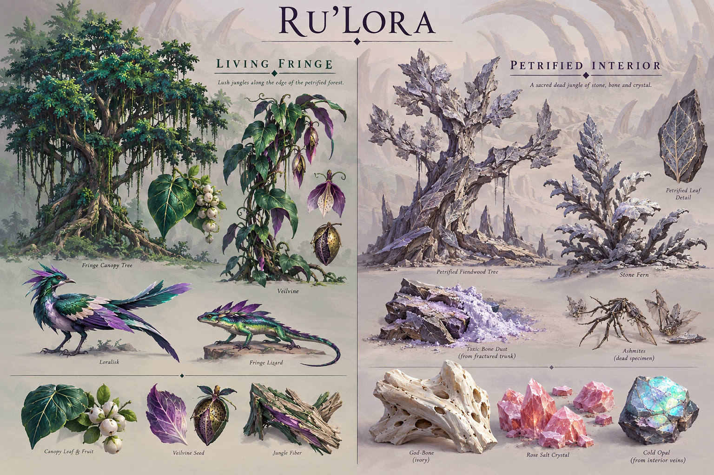

# Ru’Lora

**Status:** selected regional visual/ecological direction; livelihoods and relationships marked as working development.

## Art direction

[Regional map](../../art-direction/vaelora-v1/ru-lora-map.png) · [Flora, fauna and materials](../../art-direction/vaelora-v1/ru-lora-ecology.png)

These selected concept images establish visual direction; depicted details and specimen labels remain subject to lore and production decisions. See the [art checkpoint](../../art-direction/vaelora-v1/README.md) for provenance.

## Landscape

A petrified night jungle, toxic dust and salt caverns surround the immense remains of [Colossumbra](../colossumbra.md). Charcoal, dusty violet, ivory and cold opal define its interior.

## Life and use

The interior is hazardous and not an inhabited demon town. Lingering essence and demon refusal to make sacrilegious entry are selected anchors from the author’s story. A living emerald fringe is a proposal distinct from the petrified interior.

## Connections

Accounts of [Colossumbra and Lumastrazil](../lumastrazil.md) connect it to wider divine questions. The primary manuscript’s particular journey remains source inspiration rather than an automatically selected Vaeloran event. [Vesperra](vesperra.md) offers a separate living-forest identity.

## Open questions

The cause of petrification, divine fate, boundary of safe approach and any extraction practice remain open. Ru’Lora’s exceptional hazards should not be distributed across every region to make them seem equally important.

**Sources:** [selected map and ecology key](../../art-direction/vaelora-v1/README.md), [world-building research](../../lore-research.md). New livelihoods are working elaborations, not facts recovered from private manuscripts. See [source register](../sources.md).

[World overview](../world.md) · [Wiki index](../README.md)
