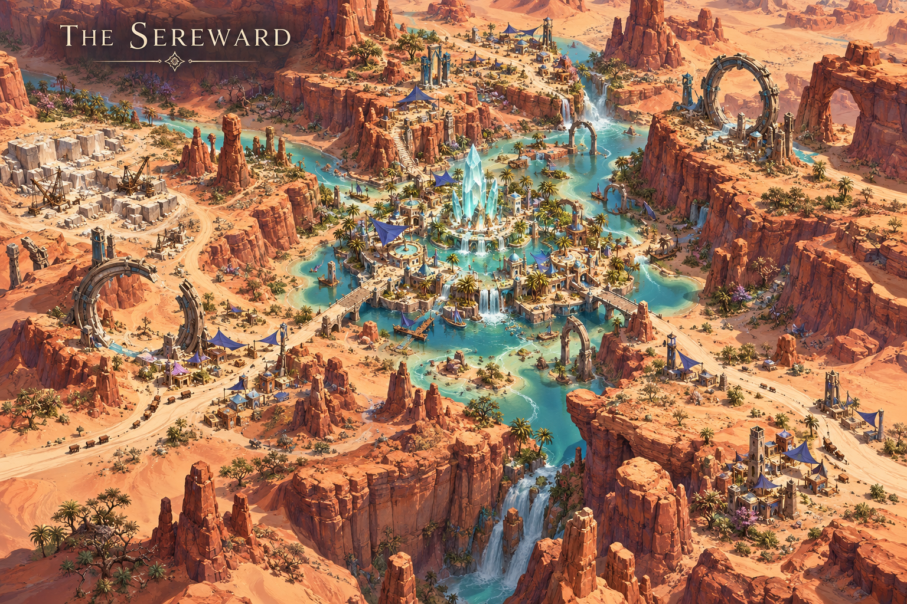
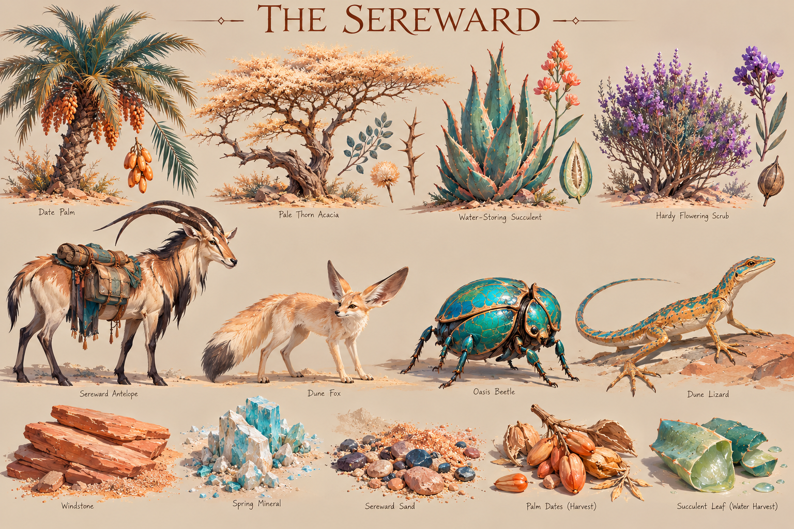

# The Sereward

**Status:** selected regional visual/ecological direction; livelihoods and relationships marked as working development.

## Art direction

[Regional map](../../art-direction/vaelora-v1/sereward-map.png) · [Flora, fauna and materials](../../art-direction/vaelora-v1/sereward-ecology.png)

These selected concept images establish visual direction; depicted details and specimen labels remain subject to lore and production decisions. See the [art checkpoint](../../art-direction/vaelora-v1/README.md) for provenance.

## Landscape

Water-storing plants, palms, oasis wildlife and caravan animals punctuate a dry landscape. Peach, coral and turquoise establish its palette.

## Life and use

[Wayfarer traditions](../wayfarers.md) link ceramics, textiles, cisterns and practical repair. Settlements need fresh water and storage; saline pools have different uses and must not be treated as drinking sources. Hospitality can be a serious obligation without eliminating the cost of travel.

## Connections

[Tassel’s Ennd](../settlements.md#tassels-ennd) is a proposed caravan stop. A channel connection at a plausible [Ellionar](ellionar.md) margin supports the working [Three Measures dispute](../three-measures.md). Its grain comes overland from [Bellweather](bellweather.md).

## Open questions

Oasis locations, route distances, crop biology and bull/jackal demographics remain open. The Soul Bandit notes inspire materials and craft, not a completed geography.

**Sources:** [selected map and ecology key](../../art-direction/vaelora-v1/README.md), [world-building research](../../lore-research.md). New livelihoods are working elaborations, not facts recovered from private manuscripts. See [source register](../sources.md).

[World overview](../world.md) · [Wiki index](../README.md)
