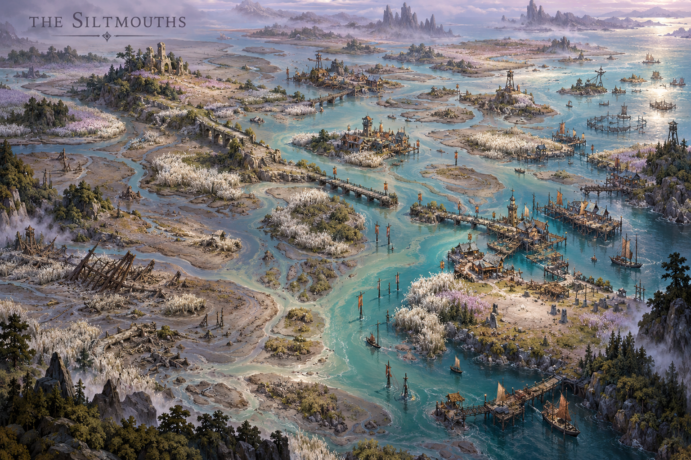
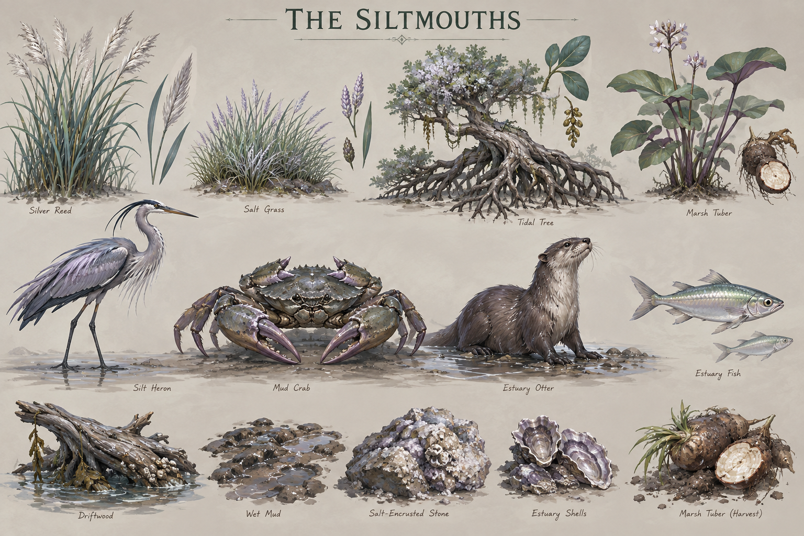

# The Siltmouths

**Status:** selected regional visual/ecological direction; livelihoods and relationships marked as working development.

## Art direction

[Regional map](../../art-direction/vaelora-v1/siltmouths-map.png) · [Flora, fauna and materials](../../art-direction/vaelora-v1/siltmouths-ecology.png)

These selected concept images establish visual direction; depicted details and specimen labels remain subject to lore and production decisions. See the [art checkpoint](../../art-direction/vaelora-v1/README.md) for provenance.

## Landscape

Reeds, exposed tidal roots, marsh tubers and reflective estuary life shape the region. Sea green, silver and muted lilac define its palette.

## Life and use

Working communities fish, grow suitable wetland crops, repair boats and navigate changing channels. Claims and access may need renewal when water alters the land. This creates a different form of practical expertise from terrace irrigation and does not make marsh life inherently poor or corrupt.

## Connections

Stored food, reeds and boat services offer possible exchange with agricultural and traveling communities. The allocation questions in [Three Measures](../three-measures.md) are a useful comparison, not an event assigned to this region. Water here is tidal and mixed; the [Sombral Mere](sombral-mere.md) has a separate lake identity.

## Open questions

Exact coasts, flood seasons, settlement names and political arrangements remain open. Marsh tubers in the art are not automatically the same plant as the Soul Bandit’s violet-fleshed tubers.

**Sources:** [selected map and ecology key](../../art-direction/vaelora-v1/README.md), [world-building research](../../lore-research.md). New livelihoods are working elaborations, not facts recovered from private manuscripts. See [source register](../sources.md).

[World overview](../world.md) · [Wiki index](../README.md)
