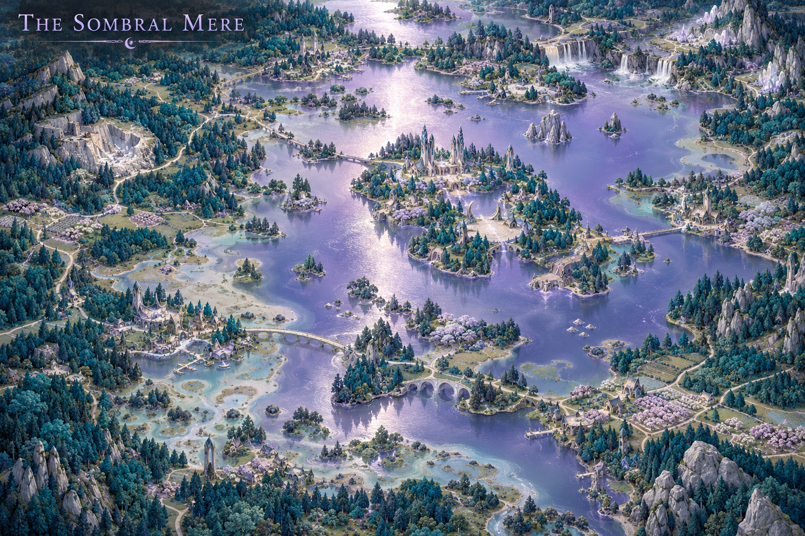
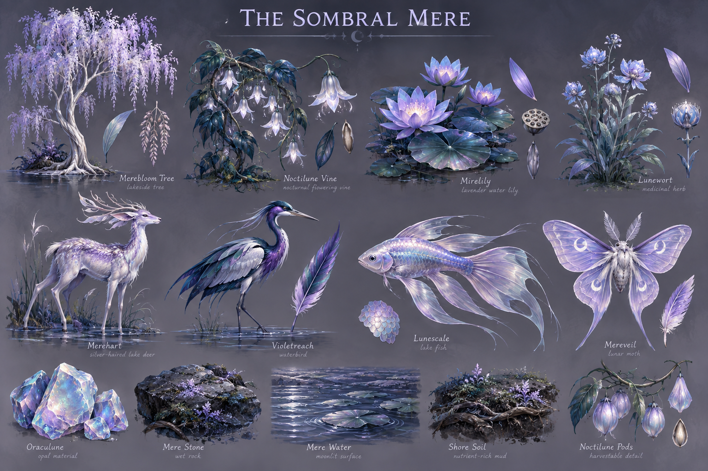

# The Sombral Mere

**Status:** selected regional visual/ecological direction; livelihoods and relationships marked as working development.

## Art direction

[Regional map](../../art-direction/vaelora-v1/sombral-mere-map.png) · [Flora, fauna and materials](../../art-direction/vaelora-v1/sombral-mere-ecology.png)

These selected concept images establish visual direction; depicted details and specimen labels remain subject to lore and production decisions. See the [art checkpoint](../../art-direction/vaelora-v1/README.md) for provenance.

## Landscape

Forest lakes, nocturnal flowers, opals and reflective aquatic fauna define a pearl, lavender and teal landscape. Lunar gardens give it a cultivated as well as mysterious character.

## Life and use

The region is associated with [Soman’ar traditions](../peoples.md#somanar--moon-elves) responding to [Lumastrazil’s silence](../lumastrazil.md). The status of inhabitants remains open because source histories describe depletion or extinction. Painted buildings cannot settle survival.

## Connections

Custodians of lunar gardens could preserve rites or materials while disagreeing about their significance. This is a development possibility, not confirmation that surviving moon elves operate every garden. Its questions of inherited knowledge connect thematically to the [Pale Meridian](pale-meridian.md).

## Open questions

The goddess’s fate, population, lake geography and effectiveness of particular rites remain open. It is not established as an infected version of an otherwise ordinary lake.

**Sources:** [selected map and ecology key](../../art-direction/vaelora-v1/README.md), [world-building research](../../lore-research.md). New livelihoods are working elaborations, not facts recovered from private manuscripts. See [source register](../sources.md).

[World overview](../world.md) · [Wiki index](../README.md)
