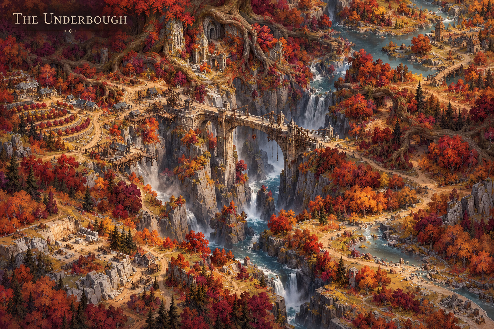
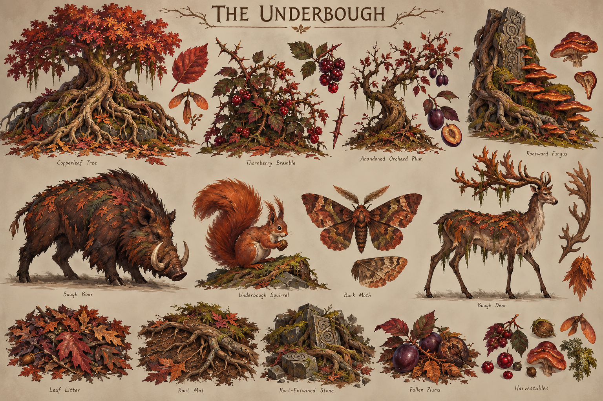

# The Underbough

**Status:** selected regional visual/ecological direction; livelihoods and relationships marked as working development.

## Art direction

[Regional map](../../art-direction/vaelora-v1/underbough-map.png) · [Flora, fauna and materials](../../art-direction/vaelora-v1/underbough-ecology.png)

These selected concept images establish visual direction; depicted details and specimen labels remain subject to lore and production decisions. See the [art checkpoint](../../art-direction/vaelora-v1/README.md) for provenance.

## Landscape

Exposed roots, brambles, fungi and moss shape a close woodland landscape. Burgundy and copper-orange accents distinguish it from the deeper, stranger canopy of [Vesperra](vesperra.md).

## Life and use

Working lore imagines communities at clearings and forest margins maintaining paths, managing cut wood and preserving knowledge of fungi. Access may depend on customary maintenance rather than one lord owning every tree. These livelihoods are proposals, not established ancestral laws.

## Connections

The working [Boughward](../institutions.md) direction could develop from woodland duties, but it has no selected jurisdiction here. Trade with agricultural places such as [Bellweather](bellweather.md) is an available relationship, not proof of a shared border.

## Open questions

No forest consciousness, universal taboo on cutting or exclusive resident ancestry is established. Which paths, settlements and customs matter remains open.

**Sources:** [selected map and ecology key](../../art-direction/vaelora-v1/README.md), [world-building research](../../lore-research.md). New livelihoods are working elaborations, not facts recovered from private manuscripts. See [source register](../sources.md).

[World overview](../world.md) · [Wiki index](../README.md)
