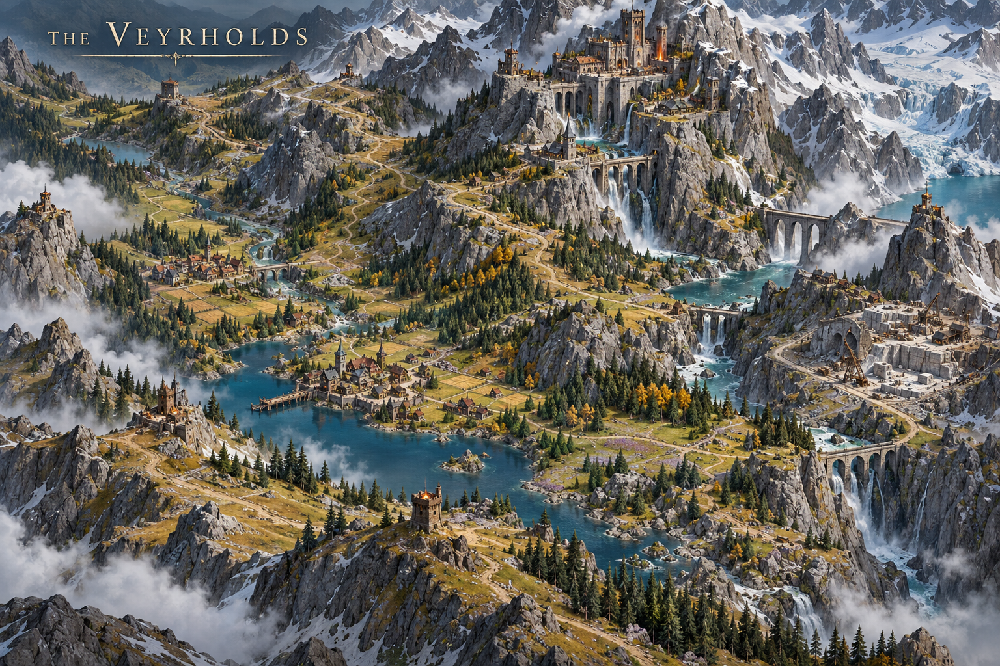
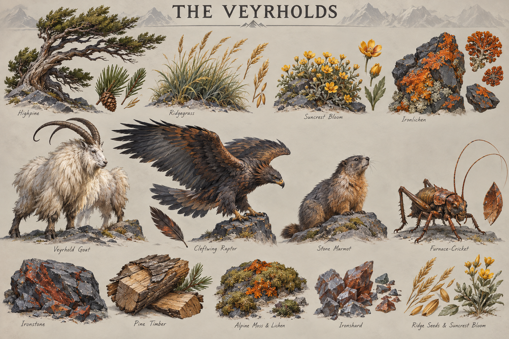

# The Veyrholds

**Status:** selected regional visual/ecological direction; livelihoods and relationships marked as working development.

## Art direction

[Regional map](../../art-direction/vaelora-v1/veyrholds-map.png) · [Flora, fauna and materials](../../art-direction/vaelora-v1/veyrholds-ecology.png)

These selected concept images establish visual direction; depicted details and specimen labels remain subject to lore and production decisions. See the [art checkpoint](../../art-direction/vaelora-v1/README.md) for provenance.

## Landscape

Wind-shaped pines, goats, raptors and iron-bearing rock characterize elevated settlements. Slate, alpine olive and rusty copper give the region a weathered palette.

## Life and use

Working lore emphasizes pass maintenance, winter stores, herd management and small-scale iron craft. Houses and meeting rooms need to shelter bodies from exposure, not merely provide fortress silhouettes. Residents can depend on imported food and timber while producing useful metalwork and animal goods.

## Connections

A trade relationship with grain-growing [Bellweather](bellweather.md) or traveling [Wayfarer crews](../wayfarers.md) is a working possibility. It must acquire a route before becoming a fixed atlas claim. Elevated seasonal life differs from the long-day/long-night pattern of the [Pale Meridian](pale-meridian.md).

## Open questions

No unified mountain kingdom, warrior ancestry or monopoly on all iron is established. Individual holds, their relationships and usable passes remain open.

**Sources:** [selected map and ecology key](../../art-direction/vaelora-v1/README.md), [world-building research](../../lore-research.md). New livelihoods are working elaborations, not facts recovered from private manuscripts. See [source register](../sources.md).

[World overview](../world.md) · [Wiki index](../README.md)
