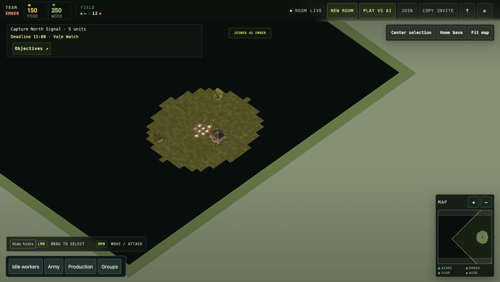

# Client module delivery incident and hosted recovery — 2026-09-27

## Failure and cause

PR #207 added `src/resource-format.mjs` and imported it from the client entry
point, but omitted it from the server's static allowlist. Local headless Chrome
on `664ecb6` displayed CLIENT ERROR and could not load `src/main.js`.
Authenticated staging probes confirmed `/ready` and `/src/main.js` returned 200
while `/src/resource-format.mjs` returned 404. Service readiness did not imply a
usable browser client.

The existing static allowlist check also detected the omission in GitHub
[run 36325031856, job 108636047159](https://github.com/lbliii/thousand-unit-skirmish/actions/runs/36325031856/job/108636047159).
It was missing from the focused pre-merge checks. The original formatting unit
checks proved display semantics, not browser module delivery.

## Fix and prevention

PR #211 (`f7d3b42`) serves the formatter and strengthens
`scripts/railway-release-scenario.mjs`: traverse static imports reachable from
`/src/main.js`, resolve relative/absolute imports and the Three.js alias, and
require HTTP 200 with JavaScript MIME from the actual packed release server.
The packed-release check failed before the fix and passed afterward.

Changes to client module imports should run the existing
`node scripts/client-asset-allowlist-scenario.mjs` as part of their focused checks.
The packed-release traversal checks the delivered result; a browser boot checks
actual module evaluation and page startup.

## Hosted recovery

A fresh disposable room was checked with `scripts/qa-staging-browser.mjs`
using `--author`, two isolated headless Chrome profiles, and injected staging
credentials. Deployment `3db72e5f-04e7-45cf-afd8-1c0f60dabd4a`, source
`469b97afbefbf177f36f0ccb606b42794f91851b`, was SUCCESS before and after.

Both seats reached ready / ROOM LIVE / 2 / 2 PLAYERS with a canvas and no
runtime-error text. Host-only Map Studio access, invalid-ID/unreachable-resource
feedback, edited JSON export, publication to both seats, and seat/map recovery
after reload all passed. The saved map was `qa-browser-mujwo5qs`.
The formatter endpoint returned 200 with JavaScript MIME after deployment.

[Browser report](qa-evidence/client-boot-recovery-2026-09-27/report.json)

The inspected Ember opening below confirms the game rendered again. It precedes
the authored-map edit; save/reload evidence comes from the runner's assertions.

This closes the observed client-loading incident on the named staging build.
It does not establish complete human play, narrow-layout comprehension, or
hosted capacity. Production was unchanged.
