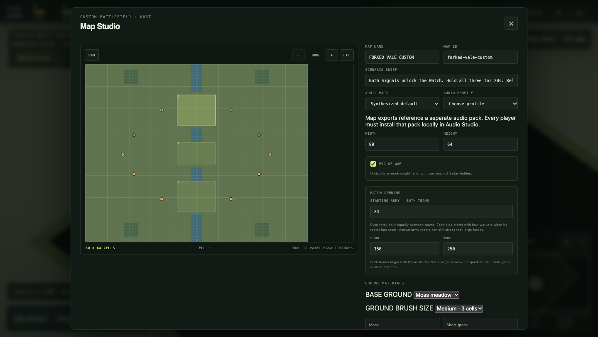

# Core tranche readiness — 29 September 2026

[QA protocol](qa-vertical-slice.md) · [Next session](core-playtest-tranche.md)

## Source and deployment

Freshly fetched `origin/main` and the local checkout both identified
`12646d66ffe46e26c082d34b5ebdad447ba64515`. Staging deployment
`0243414a-9dee-4fca-bbcd-48ddabb06116` reported `SUCCESS` at that source.
The same deployment remained active before and after the hosted checks.
Production was not changed. Local fixtures used Node 24.9.0.

## Hosted observations

The release smoke passed public readiness, unauthenticated rejection,
authenticated assets, the served client import graph, and authenticated and
unauthenticated WebSocket behavior.

The [retained match report](qa-evidence/core-tranche-2026-09-29/hosted-match.json)
passed all eight existing checks in a newly created disposable invite room:
readiness, browser assets, room creation, opposite seats, both-seat reconnect,
authored map save/reload, agreed elimination victory, and synchronized rematch.
The fixture used 250 units and a disposable elimination map, not an unassisted
Forked Vale match or a 2,000-unit measurement.

The [browser report](qa-evidence/core-tranche-2026-09-29/hosted-browser.json)
passed in a separate fresh room. Both pages reported ready, ROOM LIVE,
2 / 2 PLAYERS, matching authored-map labels, and no displayed runtime error.
Both recorded two successful WebSocket upgrades. Host-only authoring,
invalid-ID feedback, unreachable-resource feedback, a 1,868-byte map export,
publish, and both-seat reload/reclaim passed.

Visual inspection of the retained 1440 × 813 frames confirms the host editor's
map preview/settings and the Ember opening's home area, units, Town Center,
fog, resources, minimap, and objective/deadline text. These frames precede the
authoring changes; saved-map recovery is established by assertions, not the images.

The temporary orchestration wrapper initially looked for screenshots under
`/private/tmp`; the runner wrote them under `os.tmpdir()`. Copying from the
actual directory recovered the retained frames without repeating the browser
run. This was an evidence-copy failure, not a game failure.

## Local match observations

`node scripts/forked-vale-scenario.mjs 0` passed the disposable finite-resource
Forked Vale fixture. Both seats gathered food/wood, completed Barracks and trained
reinforcements; interrupted Worker cargo was retained and deposited once.
Opposite Signals left Vale Watch locked for 16 observed snapshots; Azure retook
the second Signal, captured Watch, completed the 20-second hold, and both seats
reset to the 24-unit opening. Wall-clock completion was 148.7 seconds.
This first run's output was inspected in the task but was not saved as a raw file.

The [opposite-winner run](qa-evidence/core-tranche-2026-09-29/forked-vale-ember.log)
also passed: Ember completed the hold at 147.8 wall-clock seconds, with 16 locked
Watch snapshots and both-seat rematch restoration. Its interrupted Worker food
cargo was retained, deposited once, and switched to wood.

The [seeded production fixture](qa-evidence/core-tranche-2026-09-29/pve-production.log)
passed on unmodified Forked Vale for Azure seed `20260925` and Ember seed
`4294967295`. Each accepted one Barracks, trained Infantry, and ordered the new
soldier forward. The compact HUD/selection/objective suite passed all 12 tests.

The [contested seeded match](qa-evidence/core-tranche-2026-09-29/pve-contested.log)
finished after 245 wall-clock seconds with both seats agreeing on Azure victory.
Both policies gathered, built, trained, fought, and suffered losses; same-seed
shadow replay and production/roster bounds passed. Azure first owned all three
objectives at tick 5583, Ember retook South at tick 6111, and Azure recovered it
at tick 6741 before completing the hold. This is an observed opponent retake and
response, not a human strategic-comprehension or seat-parity claim. No balance
change follows from this single pairing.

## Hosted scale liveness diagnostic

The [retained scale smoke](qa-evidence/core-tranche-2026-09-29/hosted-scale-smoke.json)
passed the same match/recovery checks plus one 10-second Dense Clash movement
window with 2,000 total units and two protocol clients. Both remained connected.

| Seat | Snapshots/s | Payload p95 | Gap p95 | Maximum gap |
| --- | --- | --- | --- | --- |
| Azure | 10.0 | 120,238 bytes | 107 ms | 160 ms |
| Ember | 10.1 | 120,238 bytes | 109 ms | 304 ms |

These are received JSON payload sizes and client arrival gaps, not compressed
wire egress or command latency. The run used the existing staging service in
`us-west2`, one replica, and `/app/data`; CPU allocation, concurrent room load,
baseline RTT, and browser rendering were not controlled or measured. This is
a bounded liveness diagnostic, not a comparable performance benchmark or M3 proof.

## Remaining product proof

No reproduced gameplay defect was found in the completed checks above. They do
not establish novice understanding, human strategic choices, construction/damage
readability across zoom/layouts, or hosted large-match performance. The next
human session and proposed measurement profile are in the
[core tranche guide](core-playtest-tranche.md). Proposed latency/recovery targets
remain proposals until the supported device/network profile is agreed.
