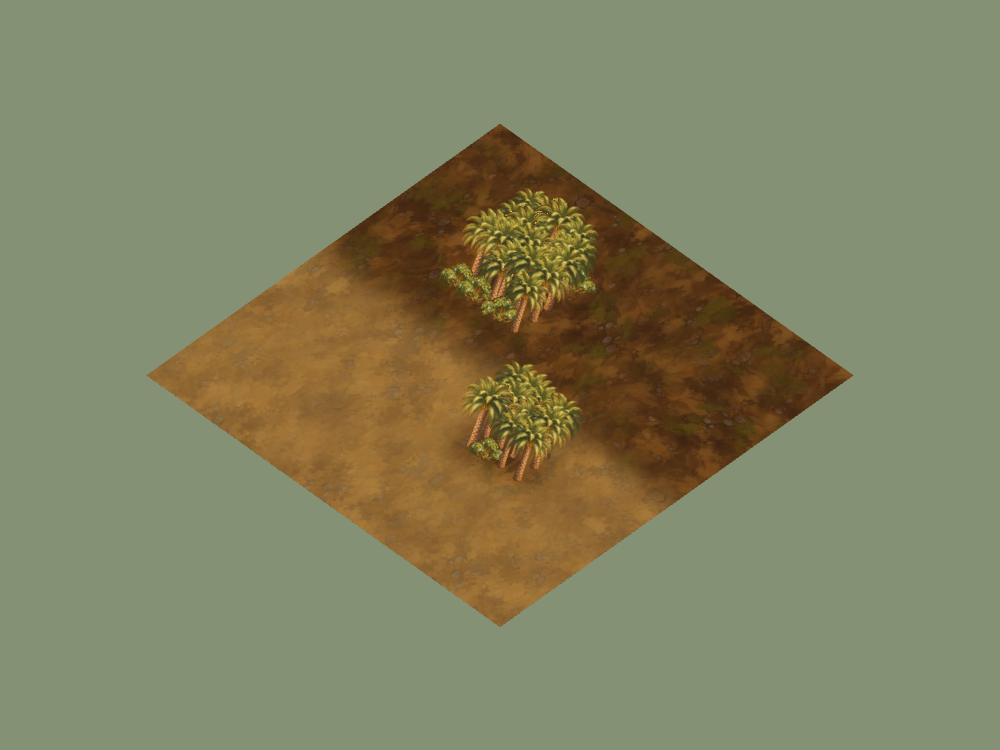
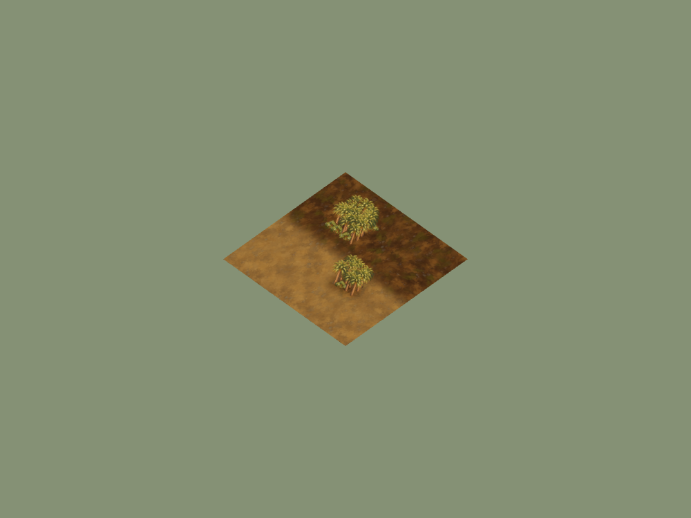

# Ellionar cultivated grove and regional root cover

30 September 2026. Candidate `codex/vaelora-ellionar-gardens`, based on
main `3ccef1c`. Local macOS headless Chrome, isolated temporary room/map data
on port 4179. Appearance/integration evidence, not hosted deployment, complete
regional production, player recognition or controlled performance.

## Art and renderer change

[Manifest](../../../assets/environment/frontier-v1/ellionar-manifest.json)
records cultivated palm/garden hedge masters, source/reference hashes and
runtime packaging. Garden-loam-base forests use a seeded approximately 80/20
mix. No fruit/crop rules are added; resource-node and stump art remain separate.
Approved ground pixels are unchanged.

The prior renderer put copper leaf-litter cover under every regional forest
with per-rectangle fringe geometry. Root cover now selects a regional ground
and uses the shared soft-mask surface. The Ellionar study places one grove on
garden loam and one over dirt, showing the same cultivated soil under both.
Nine root-cover texture bindings and two owned textures per cover are checked.
GPU cost of full-map cover masks/overdraw has not been measured.

## Reproduction and results

Run `RTS_QA_URL=http://127.0.0.1:4179 RTS_VEGETATION_REGION=ellionar node scripts/qa-vegetation-browser.mjs`
against an isolated local supervisor. It captures Forked Vale boot, renders
small garden groves at two scales, verifies six vegetation palettes and nine
root-cover cases through the consuming loader. The grove study omits UI/fog.

Browser ready boot, empty runtime-error field, zero console errors.
[Forest slot proof](forest-slot-proof.json) shows identical 36-cell addresses
across meadow/snow/scree/forest-floor/sand/garden-loam and the intended families.
[Root-cover proof](forest-cover-proof.json) records actual source filenames and
clone/mask ownership for nine base cases. [Opening requests](opening-requests.json)
show no unused regional cutouts at Forked Vale boot.

Terrain-blend scenarios check full interior, clear exterior, partial border,
no source-map mutation, equivalent rectangle decomposition and valid regional
materials; the existing normalized-join checks also pass. Woodland checks cover
cutting, finite deposit, visibility updates, clearing, checkpoint recovery and
reset. Terrain-atmosphere and client-import regressions pass. Image/reference
hashes, dimensions, alpha, syntax, docs and release packaging pass.

The cultivated olive/gold palm is upright; cream hedge flowers remain sparse.
Ground cover no longer adds a hard copper-litter island beneath the garden.
Additional compatible silhouettes, architecture/terrace props and crop/resource
art remain unfinished. The cover remains static after tree clearing, retaining
the authored soil. [Forked Vale boot](forked-vale-ordinary.png) supports normal
loading, not a garden-city art claim.
