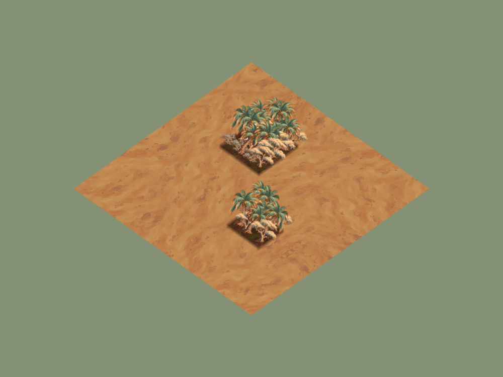
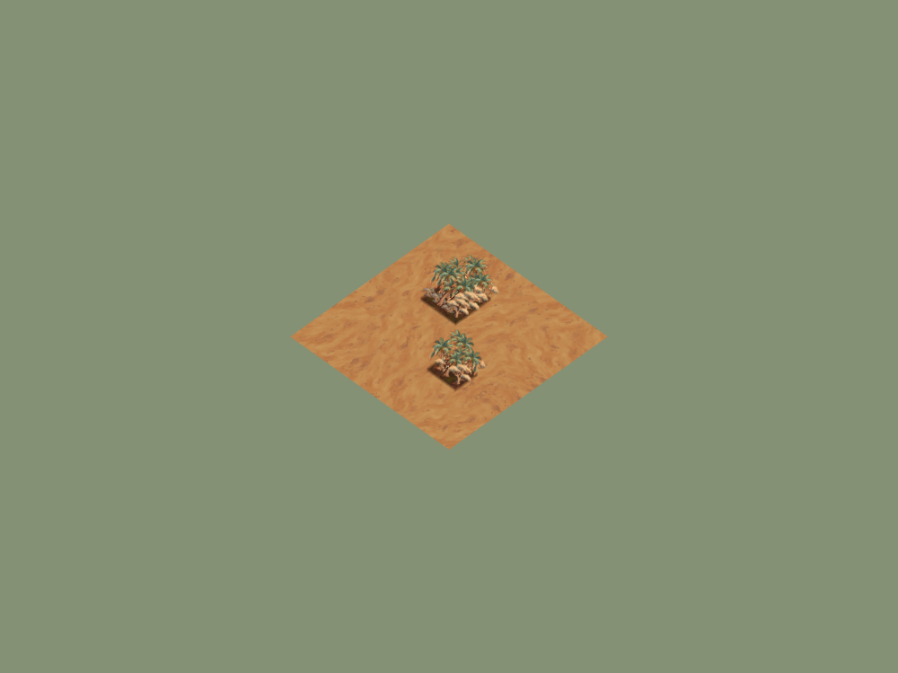
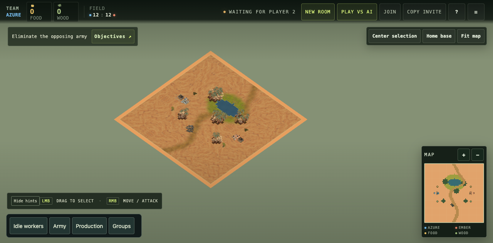

# Sereward oasis woodland checkpoint

30 September 2026. Candidate `codex/vaelora-sereward-vegetation`, based on
main `300ad86`. Local macOS headless Chrome, isolated temporary room/map data
on port 4178. Appearance/authoring evidence, not hosted deployment, complete
zone production, novice identification or controlled GPU measurement.

## Art and composition

[Manifest](../../../assets/environment/frontier-v1/sereward-manifest.json)
records palm/acacia/scrub masters, reference/source hashes, dimensions and
alpha-preserving runtime packaging. Sand-base forests use a deterministic
approximately 55/30/15 mix with existing per-cell stocks and clearing. These
sprites have no visible food fruit; ordinary resource-node art remains separate.
Approved ground textures are unchanged.

[Oasis study](sereward-oasis-study.json) uses organic row spans for water and
woodland, short grass at the oasis and a winding dirt trail around the bank.
The final trail has no water or other obstacle cells. This is a review map,
not a balanced opening or completed settlement; water edges retain current
cell-based geometry and legacy resource nodes are still visible.

## Reproduction and checks

Run `RTS_QA_URL=http://127.0.0.1:4178 RTS_VEGETATION_REGION=sereward node scripts/qa-vegetation-browser.mjs`
against an isolated local supervisor. It checks ordinary Forked Vale boot,
imports the oasis through Map Studio and uses Save & Play, captures the active
map, then renders two small desert groves at two camera scales.

The final boot is ready, title `SEREWARD OASIS STUDY`, runtime-error empty,
zero console errors. [Save/play capture](oasis-save-play.png) shows the imported
composition. [Palette proof](forest-slot-proof.json) checks identical 36-cell
forest addresses across meadow/snow/scree/forest-floor/sand, regional family
bindings and all three Sereward families with no legacy forest tree families.
[Opening requests](opening-requests.json) contain no unused regional cutouts.
Woodland depletion/deposit/fog/clearing/recovery/reset and served-client import
checks passed. Image hashes/dimensions/alpha/reference, syntax, docs and release
packaging passed; no GPU budget or deployed appearance claim is made.

Blue-green palm fans, pale flat crowns and low violet scrub separate this kit
from Bellweather and Underbough. Repeated single-family silhouettes still need
compatible variants; localized succulents/date food art and depleted palm/acacia
stumps are unfinished. The ordinary forest clearing contract uses current stump
art. Map row spans preserve authoritative water and forest collision.
