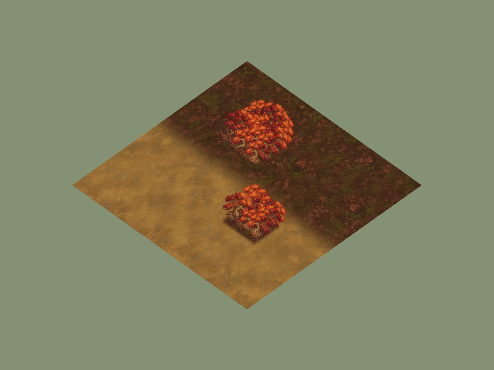
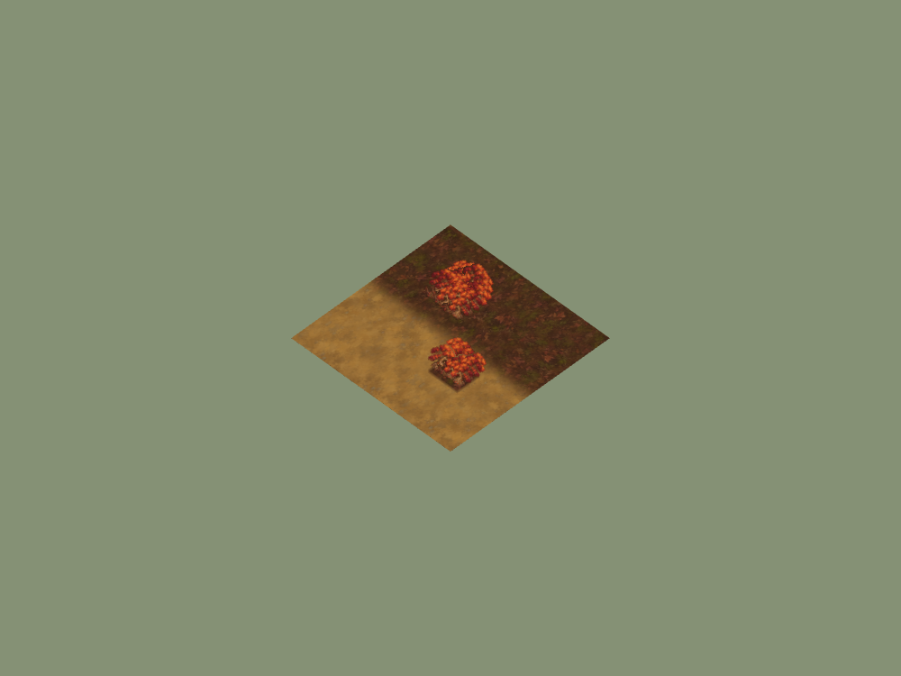

# Underbough rooted woodland checkpoint

30 September 2026. Candidate branch `codex/vaelora-underbough-vegetation`,
based on main `eed4dc8`. Local macOS headless Chrome, isolated temporary
room/map data on port 4177. Ordinary captures are appearance evidence;
no hosted deployment or comparable GPU performance is claimed.

## Art and runtime

[Pack manifest](../../../assets/environment/frontier-v1/underbough-manifest.json)
records original generated Copperleaf/bramble masters, source/reference hashes,
runtime crop bounds, dimensions and RGBA encoding. Forest-floor-base maps now
use a deterministic approximately 80/20 mix rather than mixed field/alpine
families. The existing cell addresses, wood stocks, instance clearing and
simulation collision remain authoritative. Fruitless bramble means wood only.
All approved ground textures remain unchanged.

## Reproduction and evidence

Run `RTS_QA_URL=http://127.0.0.1:4177 RTS_VEGETATION_REGION=underbough node scripts/qa-vegetation-browser.mjs`
against an isolated local supervisor. The study renders two woodland patches
over forest floor/dirt through the consuming loader, at two camera scales.
UI/gameplay fog are omitted from the study to expose art; Forked Vale captures
separately check normal boot.

The [slot proof](forest-slot-proof.json) checks the same 36 cell addresses on
meadow, snow, scree and forest floor. Underbough uses only Copperleaf/bramble
for forest trees; the other three palettes retain their intended bindings.
[Opening requests](opening-requests.json) show that Forked Vale does not fetch
unused Underbough or Veyrholds cutouts. Source textures remain cached when used;
this is not a memory-eviction system. The browser reports ready boot, an empty
runtime-error field and zero console errors.

Woodland checks cover depletion, finite deposit, visibility-filtered updates,
cleared movement, checkpoint recovery and reset. Client-import tests, syntax,
image hashes/dimensions/alpha, documentation and release packaging passed.

Copper/burgundy canopy gives the woodland a clear regional mass; low thorny
wood breaks its height. Roots remain attached to cuttable trees. The repeated
single tree silhouette still needs additional compatible silhouettes, and the
forest-ground outline retains existing cell-mask rendering. No standalone
ruins, fungal accents, food-bramble lifecycle or directional views are added.
[Forked Vale boot](forked-vale-ordinary.png) uses Bellweather vegetation and does
not prove Underbough appearance; the renderer study supports that claim.
