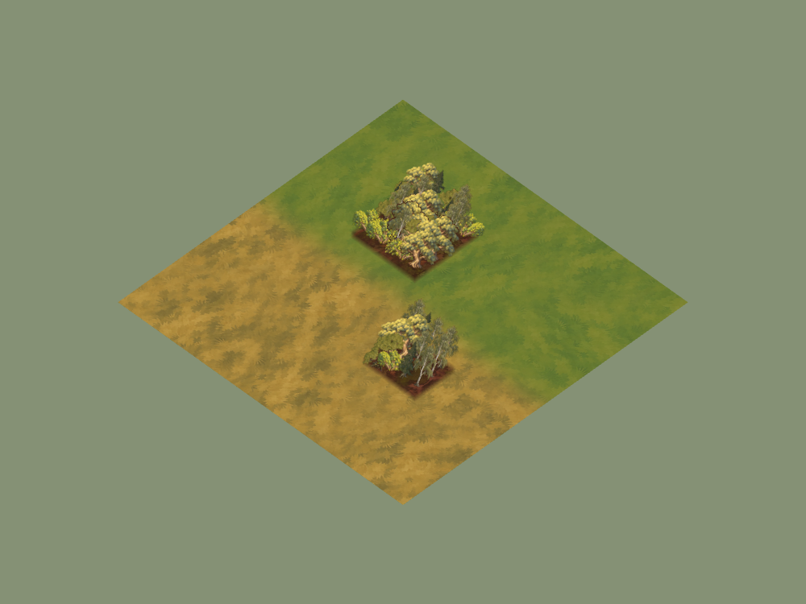
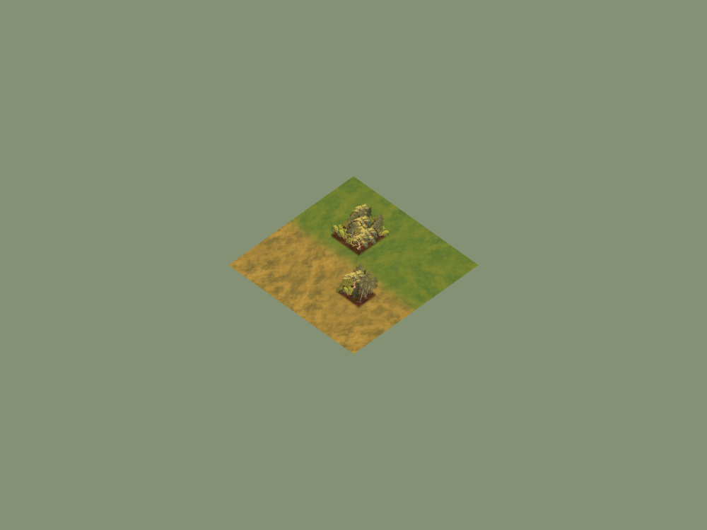

# Bellweather vegetation checkpoint

30 September 2026. Candidate based on main `846fd27`, branch
`codex/vaelora-bellweather-vegetation`. Local macOS Chrome headless, 1280×720
window; isolated room supervisor on port 4175 with temporary map/room data.
These are appearance checks, not controlled performance measurements or hosted
staging evidence.

## Source and runtime

Two new source masters/runtime cutouts: Bellweather field maple and hedgerow.
[Pack manifest](../../../assets/environment/frontier-v1/bellweather-vegetation-manifest.json)
records source output identifiers, hashes, dimensions, alpha-content crops and
encoding. Approved ground textures are unchanged. Existing forest maple and
thicket slots use these on four warm meadow base materials; all other slots
and base materials keep their previous art.

## Reproduction and checks

Run `RTS_QA_URL=http://127.0.0.1:4175 node scripts/qa-vegetation-browser.mjs`
against an isolated local supervisor. It creates a private review room, captures
Forked Vale opening and fit-map views, then renders two small forest groups over
meadow/dry-grass using the actual environment loader at two camera scales.
The study omits gameplay fog/UI to expose silhouettes; it is not a finished map.

The browser boot was ready with an empty runtime-error field and zero console
errors. The [slot proof](forest-slot-proof.json) checks the same 36 cell addresses
for meadow and snow, with Bellweather assets only in meadow. The existing
harvestable-woodland scenario passed stock depletion, deposit, fog filtering,
cleared movement, checkpoint recovery and reset. Served-client import tests
passed. Runtime assets are included by the existing Docker frontier directory
and release packaging. Docker ignores PNG masters under its existing rules.

## Captures and limits

[Forked Vale opening](forked-vale-ordinary.png) and
[fit-map view](forked-vale-strategic.png) prove boot, but opening fog hides most
woodland. The renderer study is the useful vegetation appearance evidence.
The new trees have warm grouped canopy masses and visible woody contact. Mixed
legacy pine/birch/oak remain apparent; a whole regional forest kit is unfinished.
No new resource rules, movement blocks, seasonal states, animation or GPU budget
claims are added. Ordinary resource nodes retain their existing state pack.
