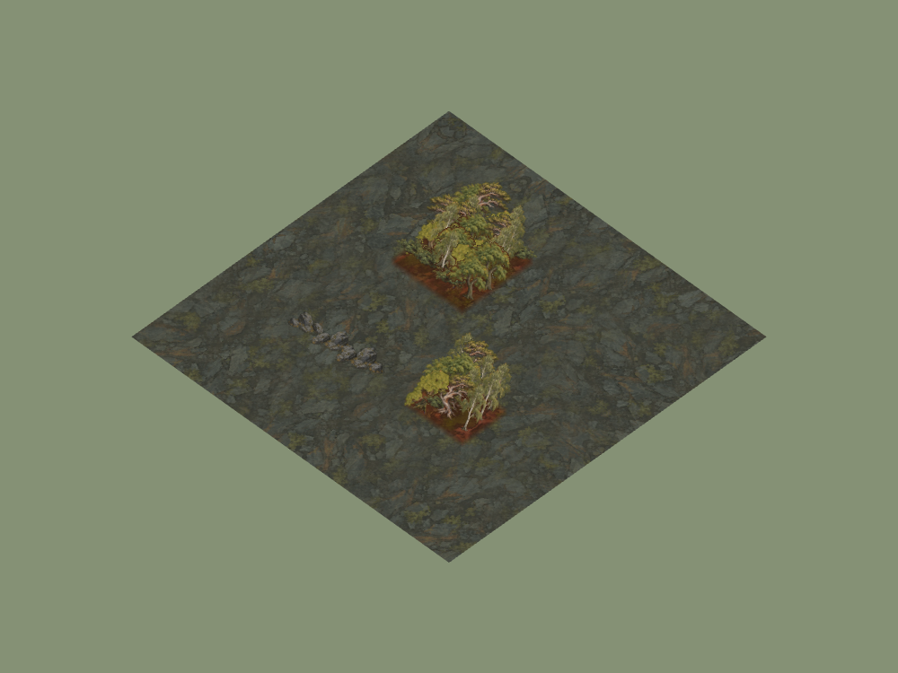
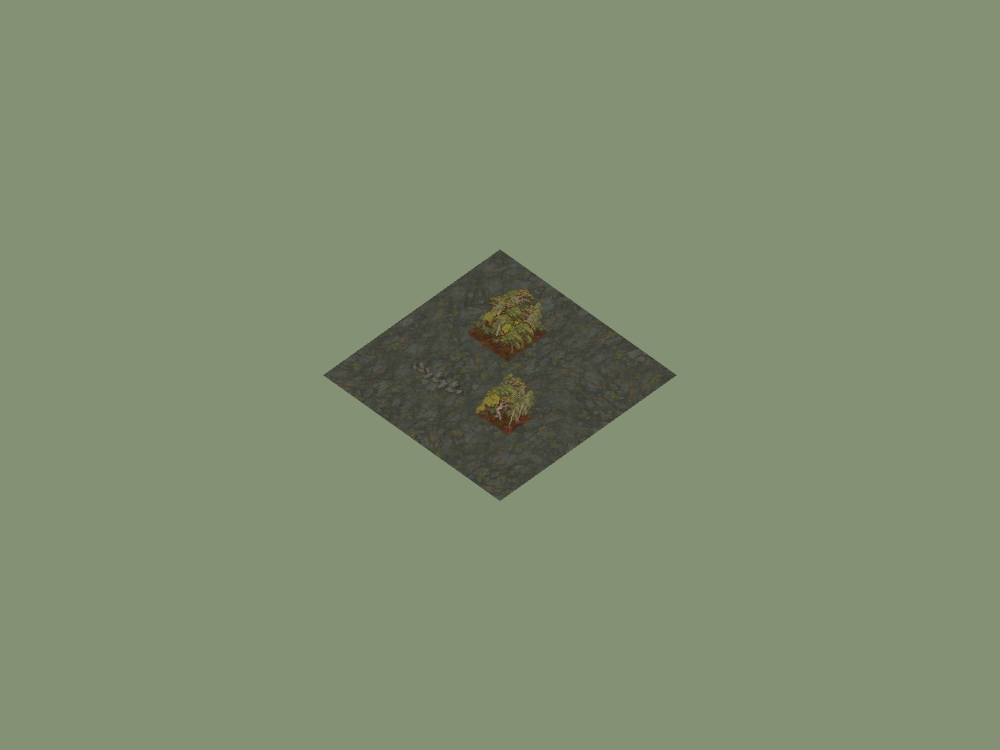

# Veyrholds vegetation and stone checkpoint

30 September 2026, candidate branch `codex/vaelora-veyrholds-pine` based on
main `abce656`. Local macOS Chrome headless, isolated temporary rooms/maps,
port 4176. This records appearance and integration, not hosted deployment,
fresh-player recognition or comparable performance.

## Art and binding

[Manifest](../../../assets/environment/frontier-v1/veyrholds-manifest.json)
records two generated source masters, their ecology-key reference hash,
RGBA runtime encodings, source output identifiers and visible-content crops.
Scree-base forest pine slots use the Highpine; low stone outcrop slots use the
ironlichen rock. Other slots and other terrain bases retain their current art.
No approved ground images, resource stocks or collision rules changed.

## Reproduction and results

Run `RTS_QA_URL=http://127.0.0.1:4176 RTS_VEGETATION_REGION=veyrholds node scripts/qa-vegetation-browser.mjs`
against an isolated local supervisor. The browser captures Forked Vale's boot,
then the consuming environment loader renders two small forest patches and a
low stone barrier over scree. The study omits UI/gameplay fog for inspection.

The browser boot was ready with no runtime error and zero console errors.
[Palette proof](forest-slot-proof.json) checks the same 36 forest cell addresses
for meadow, snow and scree, Bellweather only in meadow, and Veyrholds pine/rock
only in scree. Woodland scenario checks cutting, finite deposit, sparse fog
updates, cleared movement, checkpoint recovery and reset. Served-client import
checks, syntax, image hashes/dimensions/alpha, docs and release packaging passed.

The swept crown and trunk separate Highpine from the rounded field tree.
Copper lichen gives slate a regional accent. Legacy birch/maple/other rocks
remain in the mixed batches; the region's complete vegetation kit is unfinished.
These are fixed-view cutouts, with no added direction/seasonal variants. The
stone is an obstacle, not a new iron economy resource. GPU cost is unmeasured.
[Forked Vale boot](forked-vale-ordinary.png) does not expose the alpine art;
use the scree renderer study for that claim.
