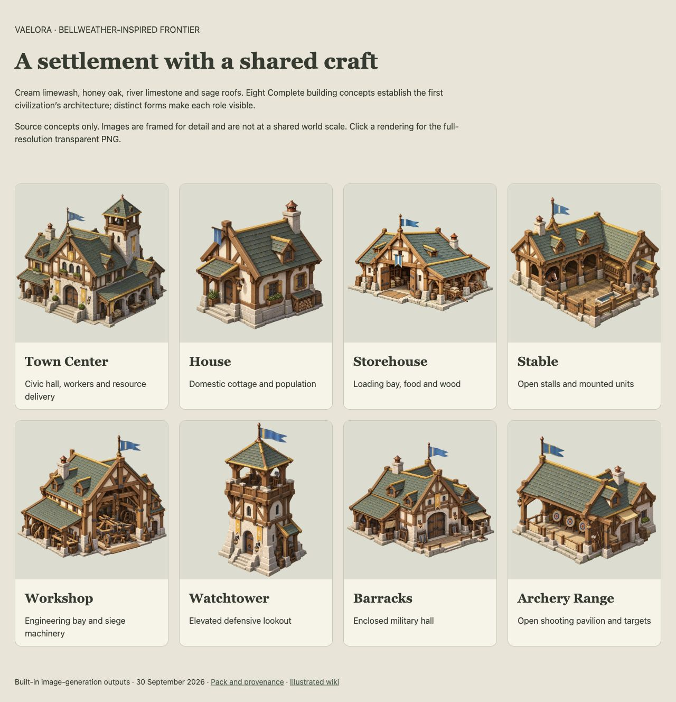

# Frontier Complete building concepts — 30 September 2026

Source review on branch `codex/frontier-building-concepts`, based on main `f896d09`. This record supports a complete eight-building concept family and wiki integration, not gameplay appearance or atlas readiness.

## Checks and observation

- Eight RGBA PNGs match all eight current `BUILDING_DEFINITIONS` IDs; each has transparent pixels and fully transparent corners. File hashes, dimensions and alpha bounds are recorded in the [manifest](../assets/buildings/frontier-civilization-concepts-v1/manifest.json).
- Inspected every generated rendering and the [local gallery](../assets/buildings/frontier-civilization-concepts-v1/preview.html) in the Codex in-app browser at 1280 × 720 screenshot dimensions. All eight image elements loaded at their expected source resolutions.
- The Town Center is a broad multi-wing civic hall with rear tower; House is a compact cottage. Stable stalls, Storehouse goods, Workshop machinery, Watchtower height, Barracks gate/weapons and Range targets provide distinct functional cues within shared cream/oak/stone/sage materials.
- The Storehouse preview initially appeared to contain a gradient. A targeted background-extraction output was selected; alpha inspection and gallery compositing confirm transparency. Both outputs are retained in generation provenance.
- `npm run docs:check` passed: 226 Markdown files, 1,253 local links. `git diff --check` passed.

## Limits and next production work

The gallery fits each concept independently; it does not prove relative world scale. Visible-base targets are proposed and require model/capture calibration beside the existing Worker. Camera poses are generated illustrations, not certified orthographic projections. Coverage is one Complete view per building. The generated blue standards often have forked tails, inconsistent with required Azure geometry; exact team shapes and masks remain production corrections. Minor door/equipment consistency and base-edge padding require controlled capture review.

Current game graphics were not replaced. No construction, damage, repair, fog, terrain-depth, camera-transition or performance claim follows from this source review. The [style guide](frontier-civilization-art-style.md), [wiki](lore/frontier-architecture.md) and [atlas plan](building-atlas-production-plan.md) carry the next work.
