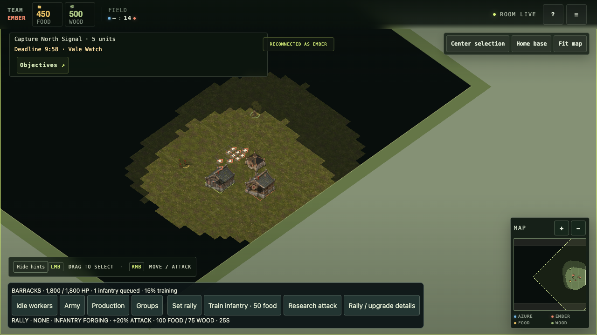
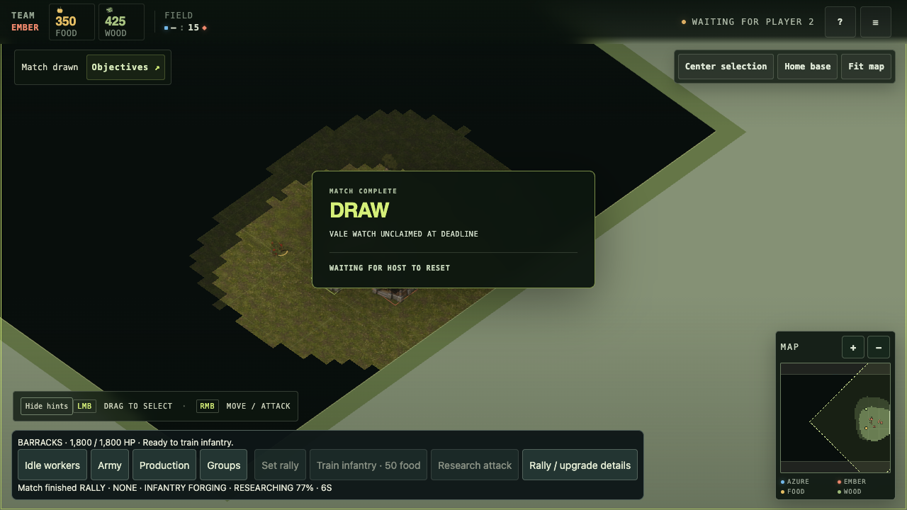
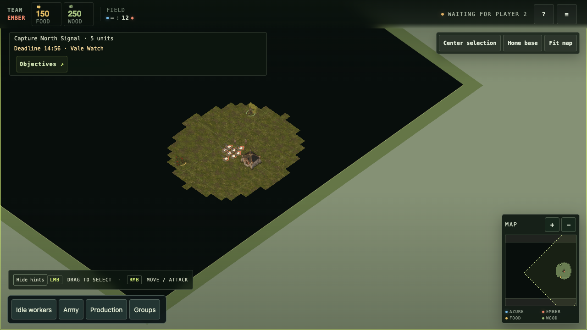

# In-flight browser recovery — 27 September 2026

[QA plan](qa-vertical-slice.md) · [Client boot incident](qa-client-boot-recovery-2026-09-27.md)

Source: `f7d3b420ae3069792f573460aef7e8034bfaafb9` after fix-forward [PR #211](https://github.com/lbliii/thousand-unit-skirmish/pull/211).
Local headless installed Chrome, 1280 × 720 CSS pixels, DPR 1. Native Mac was locked, so this used CDP mouse input, actual DOM controls, rendered screenshots, and a WebSocket send observer. Forked Vale, Ember; passive Azure protocol client. Fixture restored completed Ember Barracks/range with 500 food/wood. No runtime game rules were altered.

## Observed

- Initial audit on 664ecb6 failed client boot: main 200, imported resource-format.mjs 404. PR #211 restores allowlist delivery and extends the existing packed release smoke to traverse every static import reachable from main. Regression failed before and full release scenario passed after. Reload rendered Ember and the battlefield.
- Selected Barracks by rendered screen coordinate and queued infantry through the visible control. Closed the active browser socket; after reconnect the rendered panel showed one infantry queued, progress advancing from 14% in the DOM observation to 15% in the subsequent screenshot, and food 450. Unit later completed, increasing Ember count to 15. No automatic train resend was recorded.
- An immediate research click after train sent an order but did not deduct research resources. A later explicit research click showed 350 food/425 wood and RESEARCHING 0% / 25 seconds. Closed its socket; after reconnect the same panel showed 8% / 24 seconds, unchanged stocks, and the research control disabled. No automatic research resend was recorded.
- Restarted the local server with the checkpoint's match clock advanced to 899 seconds while accepted research had 6.83 seconds remaining. Browser reconnected; deadline produced DRAW / VALE WATCH UNCLAIMED AT DEADLINE / WAITING FOR HOST TO RESET. Research remained frozen at 77% / 6 seconds and commands were disabled with Match finished. This was an accelerated checkpoint deadline, not a played victory.
- After the old Azure reservation expired, a new Azure protocol client sent reset. Ember rendered BATTLEFIELD RESET, 150 food/250 wood, 12 units, and the new objective deadline. Result overlay, producer selection and old research panel disappeared. The browser observer still held exactly three manually initiated sends (one train and two research attempts); reconnect and reset added none.

The observer's cached latest state predates server restart and was not used as evidence of final authoritative state; final assertions use rendered DOM and screenshot.

## Rendered evidence

### Production after reconnect

### Terminal result during research

### Rematch

## Validation

All 17 existing build, camera, and rematch recovery tests passed on this source.
The disposable browser, server and protocol clients were stopped after capture.

## Limits

This is a local Ember recovery observation with disposable prepared state, not a two-human match, both-seat browser proof, packet loss test, or performance measurement. Research was interrupted before completion and reached a terminal deadline; it was not observed completing in this run. Existing actual-handler build/camera/rematch tests cover both seats separately. No further player-facing recovery defect was found in this bounded run.
