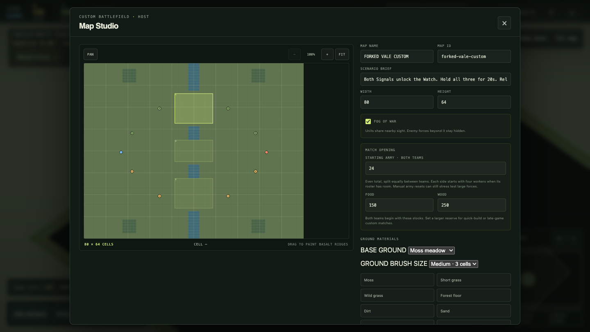

# Hosted browser and Map Studio evidence — 2026-09-27

[QA plan](qa-vertical-slice.md) · [Earlier hosted protocol checks](qa-integrated-core-2026-09-27.md)

## Build and method

Staging deployment `82d1a206-ff4b-4e77-bd58-cdaf78e70bc5` ran source
`bcd5fec632d365c7b46571d290b367b1d167f5f8` at
`https://game-staging-21f9.up.railway.app`. Railway reported this same successful
deployment before and after the check. Production was unchanged.

`scripts/qa-staging-browser.mjs ORIGIN ROOM_ID --author` ran against a newly
created disposable room using two isolated headless Chrome profiles. The
requested window was 1440 × 900; the retained PNGs are 1440 × 813. Credentials
were injected from the staging service and are absent from the evidence.

## Observed behavior

The runner exited successfully; [its report](qa-evidence/staging-browser-2026-09-27/report.json)
records both seats as ready, ROOM LIVE, 2 / 2 PLAYERS, and without a displayed
runtime error. Both had a game canvas and agreed on the map.

- Azure could open Map Studio; Ember's host-only authoring control was disabled.
- Invalid map IDs named the permitted characters. A map divided by an impassable
  wall identified `azure-berries` as unreachable from both spawns.
- Importing Stone Pass succeeded. The exported 1,868-byte JSON retained the
  capture objective, edited map ID/name, starting food of 333, and the added
  Browser Supply scenario event.
- Publishing `qa-browser-mujw0hkj` updated both browser map labels and closed the
  editor. Reloading each browser reclaimed its original seat and loaded the
  saved authored map. Each browser recorded two successful WebSocket upgrades.

## Captured appearance

These frames precede the authored-map changes. Visual inspection confirms the
host editor renders its map preview and opening settings, and the Ember opening
renders its home area, Town Center, units, fog boundary, minimap, resources, and
objective/deadline text. The compact objective reads “Capture North Signal · 5
units” and “Deadline 15:00 · Vale Watch.”

This is a named-build opening and authoring observation. It does not cover
construction/damage appearance, strategic zoom, narrow layouts, mixed-role
identification, unassisted human play, or hosted 2,000-unit performance. The
screenshots do not show the later authored map; that save/reload result comes
from the browser assertions and report.
