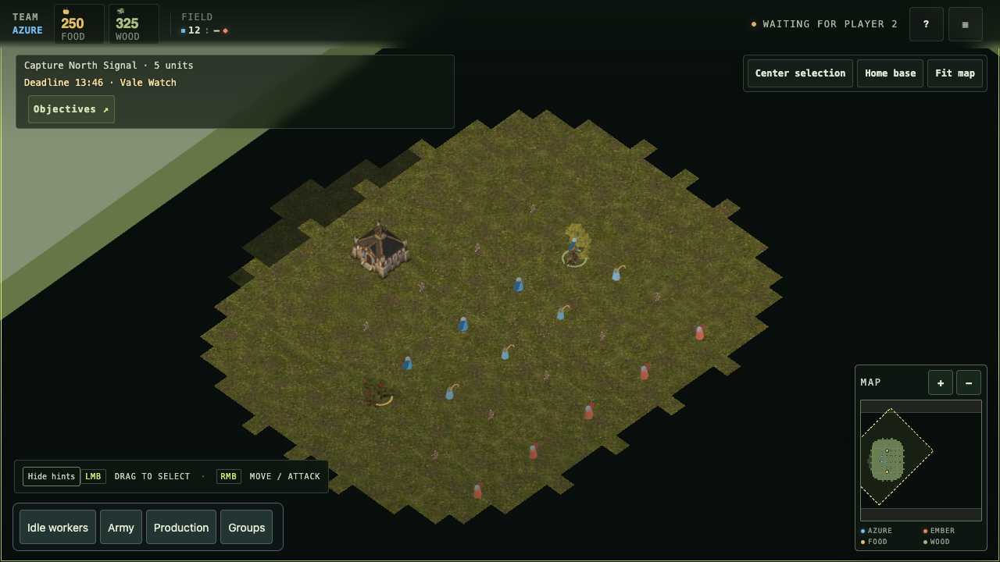
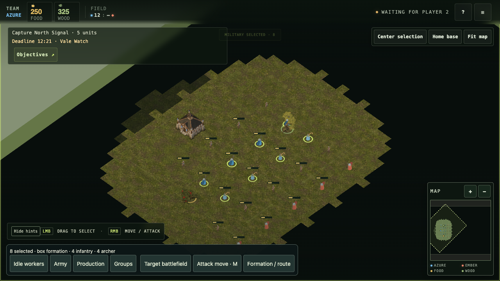
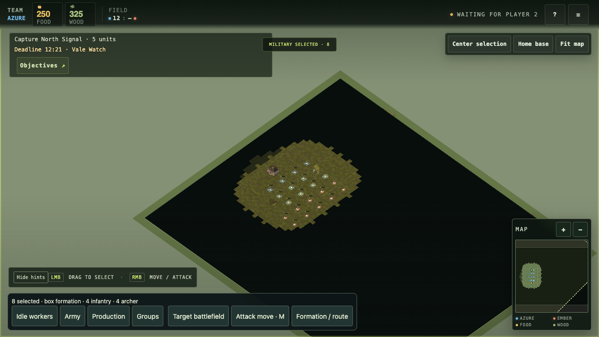
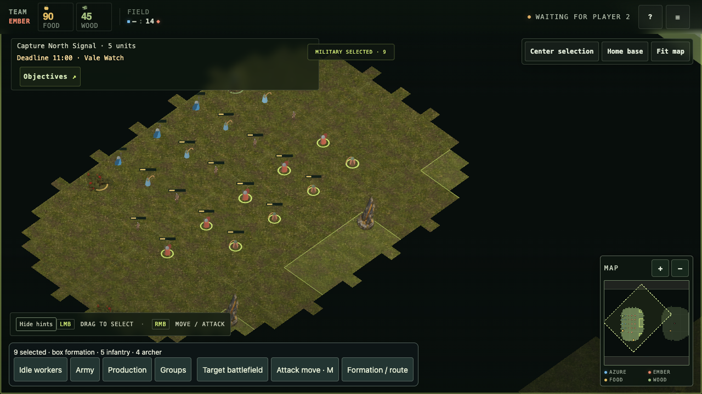
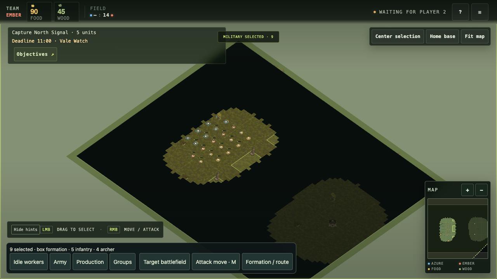

# Mixed-role health readability — 27 September 2026

[QA plan](qa-vertical-slice.md) · [Game bible](game-bible.md)

## Defect and change

Before source `a2498fc06cd6f2bd2b9ff1138528f4637093ecf9` had no unit health
bar or selected-unit HP text. The default Worker sprite bypassed mesh damage tint,
and strategic role markers also lacked damage information. In the prepared scene,
35-HP units had no readable remaining-health indicator beside 100-HP peers.

Candidate runtime `a4aad184bc5824071fcc8c4e00515008ca041c62` adds a small
camera-facing bar for visible living units below full health. Its length represents
HP; green/yellow/red thresholds match the existing building health indicator.
Healthy, defeated and fog-hidden units hide both background and fill. The same
indicator runs before sprite/mesh/strategic rendering branches, and render slots
reset with the roster on rematch. Two instanced batches share the existing unit
slot allocation; unchanged visual state skips matrix and color writes.

No art assets, combat rules, unit HP, or visibility rules changed. No client module
was added, so the existing main-module allowlist entry covers delivery.

## Conditions and reproduction

- Local Forked Vale checkpoint fixture; Chrome 153.0.8010.53 headless on macOS,
  1280 × 720 CSS pixels, DPR 1. Actual browser DOM controls, wheel input and captures.
- Default URL without preview flags: Worker v3 sprite, Infantry/Archer normal meshes
  at closer zoom and role markers at strategic zoom. All client-module requests and
  the Worker v3 atlas, runtime image and team mask returned HTTP 200 after the edit;
  no `CLIENT ERROR` appeared.
- Kept the checkpoint's 24-unit opening roster and two additional Ember units.
  For each team's slot index `j`, set role to Worker/Infantry/Archer by `j % 3`,
  `x = -26 + (j % 3) * 3 + team * 9`, `z = -7 + floor(j / 3) * 4`.
  First three units per team had 100 HP; remaining units had 35 HP. Cleared movement,
  gathering and building tasks. Fog stayed enabled. This deliberately placed both
  teams near one another without issuing attacks; it was not a played match.
- Reload starts at the client's 0.91 zoom. One wheel delta of −500 gives ordinary
  zoom `0.91 * exp(0.5) ≈ 1.500336`; then +1000 gives strategic zoom
  `0.91 * exp(-0.5) ≈ 0.551943`. Both are inside clamp limits.
- Azure used its opening camera. Ember used Army then Center selection. Army selects
  eight Azure or nine Ember military units, leaving Workers unselected. The scene
  contains healthy/damaged and selected/unselected units. Each seat's fog limits
  which opposing roles are visible; the captures do not reveal hidden enemies.

## Captures

### Before: Azure ordinary zoom

### After: Azure ordinary and strategic zoom

### After: Ember ordinary and strategic zoom

## Reference and validation

Inspected OpenRA's [SelectionDecorationsBase.cs at
9ea513cb117d3f453952efe2d5d31cf37c4bf431](https://github.com/OpenRA/OpenRA/blob/9ea513cb117d3f453952efe2d5d31cf37c4bf431/OpenRA.Mods.Common/Traits/Render/SelectionDecorationsBase.cs).
Its annotation path rejects fog-obscured actors before drawing decorations and
supports health bars for damaged actors. This informed the visibility boundary
and damaged-only policy here; no OpenRA implementation was copied.

Seven focused actual-function tests cover all roles and both teams: proportional
fill, healthy hiding, fog hiding, defeat, movement and slot reuse. The regression
fails against the prior source, which lacks the indicator. All seven and the 17
existing build/camera/rematch recovery tests pass. Rematch assertions now include
health-batch counts. The new suite is registered in CI. Syntax, whitespace and
documentation-link checks pass. After rebasing onto `5efffb1`, the same 24 tests
passed again; the final client booted and the shared HTTP import audit passed all
30 reachable modules. The preserved captures predate that unrelated audio integration.

The captures show the local rendered result, not newcomer comprehension, crowded
combat readability, color-vision accessibility, hosted behavior or performance.
At strategic zoom bars are small; no claim is made that exact HP can be read there.
The two new draw batches have not received a comparative performance measurement.
The disposable browser and server were stopped after capture.
