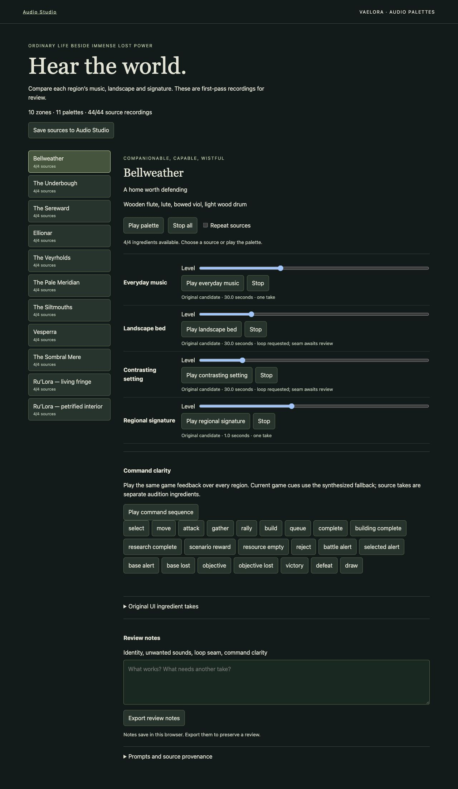

# All-zone audio palette milestone — 30 September 2026

[Zone direction](vaelora-zone-audio-plan.md) · [Source catalog](../assets/audio/vaelora-zones-v1/catalog.json) · [Audio Studio](audio-library.md)

The user requested completion of the first playable palette milestone for every Vaelora zone. The production outcome is complete: ten zones, eleven palettes (Ru’Lora fringe and interior), and 44 preserved source recordings. Each palette has everyday music, two contrasting environment beds, and one regional signature. These are reviewable candidates, not creatively accepted final game audio.

Implementation is based on `abce656` plus this milestone's changes. Browser evidence used the actual game server at `http://127.0.0.1:4197`, with its existing Forked Vale default; this was an authoring-page check, not a gameplay match. The new page is `audio-zones.html`, linked from Audio Studio and included in server and Docker release paths.

## Source evidence

All sources were downloaded through the user's subscribed ElevenLabs website. The [original flow](https://elevenlabs.io/app/flows/fvHx5prtAQnXfCiRKcZz) supplied music and early environments; a [smaller environment flow](https://elevenlabs.io/app/flows/JNpG5mkWR4yF8FI4bcLd) supplied the remaining materials after the large canvas developed browser-input delays. Plugin credentials were not changed.

Ellionar and Ru’Lora interior reuse the earlier downloaded music originals. Bellweather uses a new 30-second sketch, distinct from the earlier inaccessible pilot result. All other music requests were 30 seconds, Music v2, lyrics off. Environment requests were 30 seconds with loop on; signatures used Auto duration with loop off. Effects used the displayed Eleven SFX generator and 30% influence; the precise underlying SFX model ID was not exposed.

One Meridian plateau request exposed no recording after reload. Its prompt and node remain in `previousAttempts`; a separate alternate cold-air take fills that slot. The Veyrholds music prompt accidentally repeated the same brief during UI entry; the catalog preserves the exact submitted text. No source bytes were modified. Requested tempo/key are creative targets, not measured musical guarantees.

The 44 distinct MP3s total 19,063,837 bytes. Hashes and byte counts match preserved downloads. macOS `afinfo` recognized all files and measured duration, stereo channels and sample rate. Music is 48 kHz; effects are 44.1 kHz. Signature duration varies (including short sub-second gestures); no tail-quality acceptance is implied.

## Browser acceptance

- Every zone selector displayed 4/4 sources; overall coverage displayed 44/44.
- Every one of the 44 recordings decoded and started through its individual playback control. Each was stopped before advancing. This proves technical playback, not a listening assessment.
- Combined music plus both environment beds started for Ru’Lora interior. Repeat playback, gain changes, and stopping on zone change were exercised; repeating an original does not certify a clean seam.
- The shared current game feedback previews scheduled successfully; the base-alert label appeared. The command sequence overlays the same cues for comparisons. All 22 current cue names are exposed, plus four original UI ingredient takes. Synthesized cues remain the actual game feedback; generated ingredients have not replaced them.
- Review notes survived a zone switch and page reload. The temporary smoke note was cleared afterward.
- Saving sources created `vaelora-zone-sources-v1` in Audio Studio. A second save preserved the existing pack. Opening Audio Studio showed all 44 source records and their prompts.
- Audio Studio's exported `.audio-pack.json` passed the shared archive parser; all 44 exported original hashes matched the catalog. The export is in the user's Downloads folder. No event bindings or compositions are assigned by the source import.
- One playback check exposed a 404 for Meridian variant 02; the explicit server allowlist was fixed and that source then passed playback.

## Repository checks

`node scripts/validate-zone-audio.mjs` verifies the ten-zone / eleven-palette contract, four families per palette, 44 unique recordings, paths, source metadata, byte counts, SHA-256 hashes, and pack byte budget. It is included in CI.

Audio library archive tests, client asset allowlist checks, Docker UI-context checks, module syntax checks, documentation links and `git diff --check` passed. The standalone hardening check first failed against an existing default-port server with different peer-limit settings; it then passed against an isolated server on port 4198 configured with `RTS_MAX_PEERS=2`. A disposable release package was built with `--allow-dirty` during local validation. The full Railway release scenario passed, including HTTP delivery, `audio/mpeg` MIME type and SHA-256 verification for all 44 recordings. Its first run failed on the missing local Three.js dependency; `npm ci --ignore-scripts --no-audit --no-fund` installed the locked dependency before the passing run. These checks verify packaging, not deployment. Integration/CI state is recorded in the milestone PR.

## Next acceptance

Audition regional identity and unwanted sounds at comparable perceived loudness; edit seams and tails; test command recognition over dense play. Then author discovery/conflict arrangements and map profiles in Audio Studio. Automatic zone transitions, dynamic conflict music, final UI sample bindings, and multiplayer distribution are not part of this completed first-source milestone. No creative listening acceptance or deployed gameplay proof is claimed.

